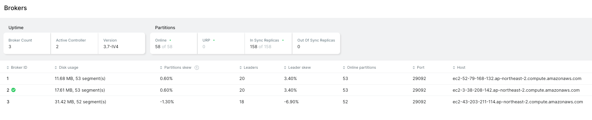

# **`Chapter14` | 합의**

## 개요

- 분산 시스템의 절정이라 할 수 있는 **분산 합의**
  - 분산 시스템에서 여러 프로세스는 합의 알고리즘을 통해 특정 값을 결정(합의)한다.
- `FLP 이론`에 의하면 완전 비동기 시스템에서는, 메시지 전달이 보장되는 시스템이라도 각 프로세스는 다른 프로세스에 장애가 발생했는지 또는 통신문제가 발생했는지 알 수 없기 때문에 일정 시간내에 합의를 보장할 수 없다고 한다.

**합의 알고리즘의 3속성**
- 일치성 : 모든 정상 프로세스는 동일한 값에 합의한다.
- 유효성 : 합의 값은 참가 프로세스 중 한 프로세스가 제안한 값이다.
- 유한성 : 모든 정상 프로세스는 결국 합의에 도달한다.
  - 알고리즘이 어떤 결론에도 도달하지 못하고 끝나지 않거나 장애가 발생한 프로세스가 복구되기만을 기다리는 상황을 방지한다.

## 브로드 캐스트
- 분산 시스템에서 자주 사용되는 통신 추상화이자 통신 방법으로, 프로세스 사이에 정보를 전파할 수 있다.
  - 예시) 한 개의 코디네이터가 모든 노드에 데이터를 전파해 데이터를 복제할 때 주로 브로드캐스트를 사용한다.
- **최선형(best effort) 브로드캐스트 알고리즘**
  - 가장 단순하지만 확실히 메시지를 브로드캐스트 할 수 있는 방법(신뢰적 통신 보장)
  - 송신 노드(sender)에서 모든 대상 노드에 메시지 전달을 보장
- **신뢰적 브로드캐스트 알고리즘**
  - 대체(fallback) 메커니즘을 사용해 구현 가능
  - 모든 노드가 전달받능 메시지를 다시 자신이 알고있는 다른 노드에 전달
  - 송신 노드에 문제가 발생해도 나머지 노드가 계속 메시지 전달하기 때문에 신뢰성 보장되고 모든 노드는 동일한 메시지 전달받을 수 있다.
  - **최선형과 다른점 : 노드 장애 발생해도 다른 노드가 재시도 하지 않음**
  - 단점 : 메시지 전달 수 가 N^2이 된다. 이상적으로 브로드 캐스트의 신뢰성을 높이려면 사용되는 메시지 수를 최소화 해야 함

## 원자적 브로드 캐스트
- 앞서 설명한 브로드캐스트는 메시지 전달은 보장하지만 **순서는 보장하지 않음.**
- 메시지를 특정 순서대로 전달하려면 신뢰성과 전 순서(total order)를 보장하는 `원자적 브로드캐스트 알고리즘`을 사용해야 함.
- 원자적 브로드캐스트는 두 가지 속성을 필수로 보장
  - 원자성 : 모든 메시지가 전달받은 메시지는 일치해야 함. **모두 전송하거나 아예 전송하지 않는다.**
  - 순서 : 모든 정상 프로세스는 메시지를 같은 순서로 전달함

### 가상 동기화
- 원자적 브캐는 `정적 프로세스 그룹`에 순서화된 메시지를 전달하는 반면, 가상 동기화는 `동적 프로세스 그룹`에 전달.
- 가상 동기화는 우선 프로세스를 여러 그룹으로 나눈다.
- 그룹이 존재하는 동안 구성원은 메시지를 동일한 순서로 받는다. 그룹 내 구성원에 동일한 순서를 정의하면 프레임워크를 사용해 성능을 높일 수 있다.(?)
- Q. 왜 기술적 장점에도 불구하고 상용 시스템에서 거의 사용되지 않는걸까?

### 주키퍼 원자적 브로드캐스트 (ZAB)
- 아파치 주키퍼에서 사용되는 알고리즘으로, 원자적 브로드캐스트 알고리즘을 구현한 대표적인 예시.
  - 아파치 주키퍼: 복제본 사이의 일관성 유지하기 위한 `이벤트의 순서와 원자적 전달을 보장`하는 분산-키 값 스토어
- ZAB 을 구성하는 프로세서는 리더 또는 팔로워 역할을 한다.
  - 리더는 임시직이며, 메시지를 브로드 캐스트하고 이벤트의 순서를 결정한다
  - 클라이언트는(카프카 브로커일까?) 새로운 값을 쓰고 최신 값을 읽기 위해서 클러스터 내 하나의 노드와 연결한다.
  - 연결한 노드가 리더라면 리더가 요청을 직접 처리하고, 팔로워라면 리더에 요청을 전달한다.
- `에포크` : 주키퍼 시스템의 특정 시간 구간을 나타내는 논리적 타임스탬프로, **각 에포크는 특정 리더의 임기를 나타낸다.**
  - 새로운 리더가 선출될 때마다 에포크 번호는 단조 증가하여 **새로운 에포크가 시작**된다.
- **ZAB 프로토콜 3단계**
1. 발견 단계
   - 새 리더는 각 프로세스가 알고있는 마지막 에포크를 수집 후, 그중 가장 큰 에포크보다 큰 새로운 에포크를 제안(단조 증가)
   - 팔로워는 리더가 보낸 새 에포크를 수락 혹은 거절하고 자신의 최신 상태 정보(마지막 처리한 트랜잭션)를 리더에게 전송
   - 이 과정을 거쳐 팔로워는 새로운 리더를 공식적으로 인정(새로운 리더를 발견하는 단계)
2. 동기화 단계
   - 리더는 팔로워들과 상태를 동기화하며 새로운 에포크(시대)를 대표하는 새로운 리더가 선출된 것을 알리고 응답을 기다린다.
   - 모든 응답이 도착하는 즉시 새 리더가 확정됨.
   - 새로운 리더는 모든 팔로워가 동일한 히스토리를 갖도록 이전 에포크에서 미처리된 트랜잭션을 처리한다.
   - 모든 서버가 같은 상태를 갖도록 동기화한다. **동기화가 완료되어야 새로운 에포크의 메시지 전파를 시작할 수 있다.**
3. 브로드캐스트 단계
   - 모든 팔로워가 동기화 되면 메시지 전파를 다시 시작함
   - 리더는 클라이언트의 메시지를 수신해 팔로워에 전파
   - 새로운 제안을 전파하고 **팔로워의 응답이 정족수를 충족하면 커밋**한다.
   - 이 방식은 중단없는 2단계 커밋과 유사함.
> ### 정족수 : 의사결정에 필요한 최소한의 동의 수
> - 5대 서버가 있는 주키퍼. 정족수는 (N=5)/2 + 1 = `3`
> - 리더가 데이터 변경 제안
> - 리더 포함 3대(정족수)가 이를 승인하면 변경사항이 커밋된다.
> - 나머지 2대가 일시적 네트워크 문제로 응답하지 못해도 시스템은 안전하게 변경사항을 적용할 수 있다.

### 메시지 순서 확립
- 메시지는 순서대로 전달돼야 하기 때문에 리더는 이전 메시지에 대한 응답을 수신할 때 까지 다음 메시지를 보내지 않는다.
- 팔로워가 같은 메시지를 중복 수신하더라도 메시지의 순서만 보장되면 문제없다.
- ZAB 는 하나의 리더가 `1) 쓰기 요청을 수신`하고 `2) 수행 순서를 결정`해  `3) 수정 사항을 브로드캐스트` 하므로 클라이언트의 여러 동시다발적 요청을 처리할 수 있다.
- ZAB 의 전역적 메시지 순서는 복구 효율을 향상시킨다.
  - 동기화 단계에서 팔로워는 가장 최근에 커밋된 트랜잭션의 식별자로 응답하고, 리더는 가장 높은 식별자를 반환한 팔로워로부터 메시지를 복사한다.
  - `Q. 그럼 다른 팔로워에서 보낸 높지 않은 식별자의 트랜잭션은 무시되는건가? (354pg)`

### 두 번의 메시지 교환으로 고효율 브로드캐스트 달성
- ZAB 의 장점은 높은 효율성임. 브로드 캐스트 단계는 단 두번의 메시지 교환으로 충분하다.
1. 첫 번째 메시지 교환 : 제안(proposal)
   - 리더 -> 팔로워
   - 리더가 새로운 트랜잭션이나 상태 변경을 제안하고 승인을 요청함
2. 두 번째 메시지 교환 : 승인 및 커밋
   - 팔로워 -> 리더(승인), 리더 -> 팔로워(커밋)
   - 승인 : 팔로워들이 제안을 검토하고 승인 메시지를 리더에게 전송
   - 커밋 : 정족수의 승인을 받으면 커밋 메시지를 팔로워에게 전송
   - 최종적으로 변경사항을 모든 노드에 적용
  > 이 과정의 효율성:
  > - 최소한의 메시지: 전통적인 합의 프로토콜에 비해 메시지 교환 횟수가 적습니다. 
  > - 병렬 처리: 리더는 첫 번째 메시지를 보낸 후, 다음 제안을 준비할 수 있어 처리량이 높습니다. 
  > - 비동기 처리: 리더는 모든 팔로워의 응답을 기다리지 않고, 정족수만 충족하면 진행합니다. 
  > - 배치 처리: 여러 제안을 하나의 메시지에 묶어 보낼 수 있어 네트워크 사용을 최적화합니다. 
  > - 빠른 결정: 두 번의 메시지 교환으로 빠르게 합의에 도달할 수 있습니다.
  
## 팍소스
- 원자적 브로드캐스트와 합의 알고리즘은 목적과 구현 측면에서 많은 유사점을 공유한다.
- 팍소스는 가장 많이 사용되는 합의 알고리즘.
  팍소스는 에게해 제도의 팍소스 섭의 입법과 투표 방식에서 유래한 단어라고 한다.
- 팍소스의 참가자는 제안자, 수락자, 학습자 중 하나의 역할을 수행함
  - 제안자 (proposer)
    - 클라이언트로부터 전달받은 값을 제안하고 수락자의 의견을 수렴함
  - 수락자 (Acceptor)
    - 제안자가 제안한 값을 수락 또는 거부한다.
  - 학습자 (Learner)
    - 수락된 제안의 결과를 저장하는 복제 노드 역할을 한다.
- 모든 참가자는 모든 역할을 맡을 수 있고, 대부분의 구현 방식에서 참가자는 `동시에 여러 역할`을 수행한다.
- 모든 제안은 클라이언트가 `제안한 값`과 단조 증가하는 `제안 번호`로 구성된다.
  - 제안 번호는 `(id, timestamp)` 쌍 형식으로 타임스탬프가 같을 경우 노드의 id 를 비교 키로 사용한다. 

### 팍소스 알고리즘
- 대략적 개요 : 제안자는 클라이언트의 첫 접촉점으로 전달받은 제안 값에 대한 수렴자의 의견을 수집한다.
  - 이후에 수락자는 합의 값에 대한 정보를 학습자에 전파해 합의 결과를 반영한다.
  - 학습자는 합의 값을 여러 복제 노드에 저장한다.
- 팍소스 알고리즘은 선출과 복제 단계로 이뤄진다.
  - 선출 : 여러 제안자들은 리더가 되기 위해 서로 경쟁
  - 복제 : 제안자는 수락자에 값을 전파한다.

## 래프트
- 래프트에서 각 노드는 다음 중 하나의 역할을 수행함
- 후보자
  - 리더 역할은 일시적으로 유지되며 어떤 노드라도 리더가 될 수 있다.
  - 리더가 되기 위해 노드는 후보자 상태로 전환하고 과반의 표를 얻어야 한다.
  - 만약 어떤 후보자도 과반의 표를 얻지 못하면 새로운 임기를 시작하고 선출 과정을 다시 시작한다.
- 리더
  - 클러스터 리더는 클라이언트의 요청을 처리하고 복제된 상태 기계(노드를 말하는건가?)와 상호 작용한다.
  - 리더는 임기 동안 역할을 유지하고, 임기는 순차 증가하는 숫자로 식별된다.
  - 네트워크 파티션 또는 메시지 지연으로 인해 장애가 발생했다고 판단되면 새로운 리더를 선출한다.
  - 
- 팔로워
  - 로그를 저장하고 리더와 후보자의 요청에 응답하는 수동적인 참가자.
  - 모든 참가자는 팔로워로 시작한다.

### 래프트 알고리즘의 수행 단계
- 리더 선출
  - 후보자 P1 은 RequestVote 메시지를 모든 참가자에 전송
  - 과반의 표를 얻은 후보자는 현재 임기의 리더로 선출된다. 참가자는 최대 하나의 후보자를 선택할 수 있다.
- 주기적 하트비트
  - 래프트는 하트비트 메커니즘으로 참가자의 라이브니스를 보장한다.
  - 설정된 타임아웃 전에 팔로워가 하트비트를 받지 못하면, 리더에 장애가 발생한것으로 판단하고 새로운 리더를 선출한다.
- 로그 복제 / 브로트캐스트
  - 리더는 AppendEntries 메시지를 보내 로그에 새로운 항목을 추가할 수 있다.
  - 메시지에는 리더의 임기, 인덱스, 직전에 전송한 로그의 임기, 하나 이상의 새로운 힝목을 포함한다.

### 래프트의 리더
- 모든 커밋된 항목이 저장된 노드만이 리더가 될 수 있다.
- 선출 과정에서 팔로워의 로그가 후보자보다 더 최신일 경우 팔로워는 투표를 거부한다. (후보자의 로그에 커밋된 항목이 최신이 아니기 때문)
- 선출된 리더는 클라의 요청을 수신하고 팔로워에 전달한다. 자신의 로그에 새로운 항목을 추가하고 모든 팔로워에 병렬로 전송한다.

## 비잔틴 합의

