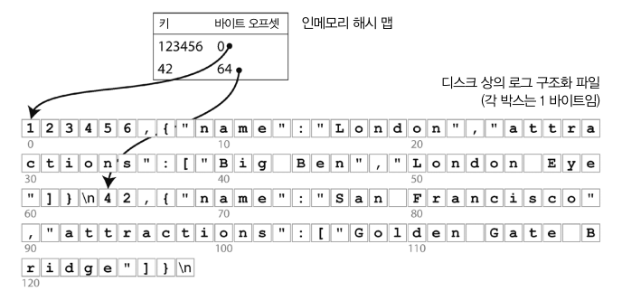

# 3장

## 서론

데이터베이스가 데이터를 저장하는 방법과 데이터를 요청했을 때 다시 찾을 수 있는 방법을 설명. ⇒ 데이터베이스 관점에서 살펴보기.

개발자가 디비 내부 동작원리(저장과 검색 방법)를 알아야 하는 이유가 뭘까?

→ 특정 작업 부하 유형에서 좋은 성능을 내게끔 저장소 엔진을 조정하려면 저장소 엔진 내부에서 수행되는 작업의 대략적인 개념을 파악해야 함. 

## 데이터베이스를 강력하게 만드는 구조

- 저장소에 데이터가 쌓일수록 db_get(데이터 조회 함수)의 검색비용은 늘어난다 → O(n)
    - 데이터베이스의 레코드 수가 두배로 늘면 검색 시간도 두배로 늘어남 → 대책이 필요함
- 색인은 기본데이터에서 파생된 추가적인 구조.
    - 데이터베이스는 색인의 추가/삭제를 허용하는데 이 작업은 데이터베이스의 내용에는 영향을 미치지 않음.
        - 단지 질의 성능에만 영향을 미침
- 어떤 종류의 색인이라도 쓰기 작업시 약간의 오버헤드는 발생할 수 있다.
    - 데이터를 쓸 때마다 매번 색인도 갱신해야 하기 때문.
- 이는 저장소 시스템에서 중요한 트레이드 오프.
    - 색인을 잘 선택했다면 읽기속도는 빨라지지만, 쓰기속도는 떨어뜨린다.
    - 이런 이유로 DB 는 보통 자동으로 모든걸 색인하지 않는다.

### Hash Indexing

- 키-값 데이터 색인 → 매우 일반적이고 더욱 복잡한 색인을 위한 구성 요소로 유용.
- 인메모리 데이터 구조를 사용한다고 가정
    - 키를 데이터 파일의 바이트 오프셋에 매핑하여 인메모리 해시 맵을 유지.
    
    
    
- 데이터가 파일에 항상 추가만 되면 결국 디스크 공간이 부족해진다.
    - 특정 크기의 세그먼트로 로그를 나누어 해결할 수 있다.
    - 특정 크기에 도달하면 세그먼트 파일을 닫고 새로운 세그먼트 파일에 이후 쓰기를 수행한다.
- 해시 색인의 한계
    - 해시 테이블을 메모리에 저장해야 하므로, 키가 너무 많으면 문제가 된다.
    - 디스크가 가득 찼을 때 확장하는 비용이 비싸며 해시 충돌 해소를 위해 성가신 로직이 필요하다.
    - 해시 테이블은 `범위 질의`에 효율적이지 않다. 단순히 모든 개별 키를 조회해야함.

## SS 테이블과 LSM 트리

정렬된 문자열 테이블(Sorted String Table) : key 로 정렬된 형식을 의미

SS 테이블은 해시 색인을 가진 로그 세그먼트 보다 몇가지 장점을 가진다.

### SS 테이블 생성과 유지

- 메모리에 정렬된 구조를 유지하는 편이 쉽다.
- Red-Black Tree 나 AVL 트리 같은 데이터 구조를 이용하면 임의 순서로 키를 삽입하고 정렬된 순서로 해당 키를 다시 읽을 수 있다.

### SS테이블에서 LSM 트리 만들기

LSM : `Log Structured Merge Tree`로그 구조화 병합 트리 : 정렬된 파일 병합과 컴팩션 원리를 기반으로 하는 저장소 엔진을 LSM 저장소 엔진이라 부름.

LSM 트리의 기본 개념은 백그라운드에서 연쇄적으로 SS 테이블을 지속적으로 병합하는 것.

- 이 개념은 데이터 셋이 가능한 메모리 보다 훨씬 크더라도 효과적.
- 데이터가 정렬된 순서로 저장돼 있다면 범위 질의를 효율적으로 실행 가능.

### B Tree

- 가장 일반적인 색인구조 B Tree
- 쓰기 동작은 새로운 데이터를 디스크 상의 페이지에 덮어쓴다.
- 덮어쓰기가 페이지 위치를 변경하지 않는다고 가정한다.
    - 즉 페이지를 덮어쓰더라도 페이지를 가리키는 모든 참조는 온전하게 남는다.
- LSM 트리(로그 구조화 색인) 와는 아주 대조적인데, 로그 구조화 색인은 파일에 추가만 할 뿐 같은 위치의 파일은 변경하지 않는다.

### B Tree 최적화

- 페이지 덮어 쓰기와 고장 복구를 위한 WAL 대신 일부 DB 는 쓰기 시 복사 방식(copy on write scheme) 사용
- 페이지에 전체 키를 저장하지 않고 키를 축약해 사용하면 공간을 절약할 수 있다.
- 트리에 포인터를 추가. 각 리프 페이지가 양쪽 형제 페이지에 참조를 가지면 상위 페이지로 다시 이동하지 않아도 순서대로 키를 스캔할 수 있다.

### B 트리와 LSM 트리 비교

- 읽기 속도 : B Tree > LSM Tree
- 쓰기 속도 : LSM Tree > B Tree
- LSM 트리에서 읽기 속도가 더 느린 이유는 각 컴팩션 단계의 여러 데이터 구조와 SS 테이블을 확인해야 하기 때문.

### LSM Tree 장점

- B Tree 보다 쓰기 처리량을 높게 유지 가능
- 상대적으로 `쓰기 증폭`이 더 낮고 트리에서 여러 페이지를 덮어쓰지 않고 순차적으로 컴팩션된 SS 테이블 파일을 쓰기 때문.
    - 쓰기 증폭 : DB에 쓰기 한번이 DB 수명 동안 디스크에 여러 번의 쓰기를 야기하는 효과.
    - 자기 하드 드라이브는 순차 쓰기가 임의 쓰기보다 훨씬 빠르다.
- 압축률이 더 좋다.
    - 보통 B Tree 보다 디스크에 더 적은 파일을 생성
    - B Tree 엔진은 파편화로 인해 사용하지 않는 디스크 공간 일부가 남는다.
    - LSM 트리는 페이지 지향적이지 않고 주기적으로 파편화를 없애기 위해 SS 테이블을 다시 기록 → 저장소 오버헤드가 더 낮다.

### LSM Tree 단점

- 컴팩션 과정이 진행중인 읽기, 쓰기의 성능에 영향을 준다.
    - 디스크에서 비싼 컴팩션 연산이 끝날 때 까지 요청이 대기해야 하는 상황 발생하기 쉽다.
- 높은 쓰기 처리량에서 또다른 컴팩션 문제 발생
- 쓰기 처리량이 높음에도 컴팩션이 유입 쓰기 속도를 따라갈 수 없는 경우가 생길 수 있다.
    - 이 경우 디스크 상에 병합되지 않은 세그먼트 수는 디스크 공간이 부족할 때 까지 증가함.
    - 더 많은 세그먼트 파일을 확인해야 하기 때문에 읽기 또한 느려진다.

---

Log Structured Storage Engine

- Log File 기반으로 작동하는 저장소
- append-only 방식으로 저장 → 이미 저장된 데이터는 immutable

SS 테이블을 압축하는 다양한 전략 → size-tiered , leveled compaction

- 블룸 필터