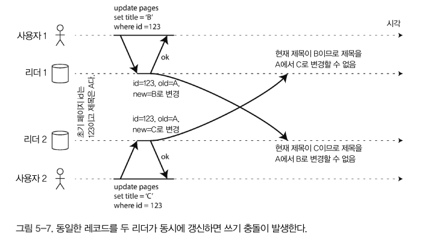

# 5장

데이터 복제가 필요한 이유

- 지리적으로 사용자와 가깝게 데이터를 유지해 지연 시간 줄임
- 일부 시스템에 장애 발생해도 지속적으로 동작할 수 있어 고가용성 유지
- 읽기 질의를 제공하는 장비의 수를 확장해 읽기 처리량을 늘린다.

데이터 복제의 어려움은 `데이터의 변경 처리`에서 비롯된다.

### 리더와 팔로워

- 복사본을 저장하는 각 노드를 복제서버(replica) 라고 한다.
    - 모든 복제 서버에 모든 데이터가 있다는 사실을 어떻게 보장할 수 있을까?
- DB의 모든 쓰기는 모든 복제 서버에서 처리돼야 한다.
    - 가장 일반적인 해결책 : 리더 기반 복제 (=마스터-슬레이브 복제)

리더 기반 복제

- 복제 서버 중 하나를 리더로 지정
    - 클라이언트가 쓰기를 할 땐 항상 리더에게 요청을 보내고, 리더 노드의 로컬 저장소에 데이터 기록
- 다른 복제 서버는 팔로워라 부른다.
    - 리더가 새로운 데이터를 기록할 때 마다 데이터 변경을 `복제 로그`나 `변경 스트림`의 일부로 팔로워에게 전송.
    - 각 팔로워는 로그를 받아 리더가 처리한 것과 동일한 순서로 모든 쓰기를 적용해 로컬 복사본을 갱신

### 동기식 대 비동기식 복제

- 동기식 복제의 장점
    - 리더와 팔로워가 일관성 있게 최신 데이터 복사본을 가지는 것을 보장
    - 갑자기 리더가 작동하지 않더라도 데이터는 팔로워에서 계속 질의할 수 있다.
- 단점
    - 동기 팔로워가 응답하지 않으면 쓰기가 지연될 수 있다.
    - 리더는 모든 쓰기를 차단(block)하고 동기 복제 서버가 다시 사용할 수 있을 때 까지 기다려야 한다.
    - 때문에 모든 팔로워가 동기식인 상황은 비현실적이다.
- 현실적으로 동기식 복제를 사용하려면 보통 팔로워 하나는 동기식으로 하고 그 밖에는 비동기식으로 하는 것을 의미. 이런 설정을 반동기식(semi-synchronous) 라 한다.
    - 그럼 팔로워가 1대 뿐이라면 그 시스템은 무조건 동기식 복제를 하는 것..?(ex 우리회사 Aurora Cluster)

보통 리더 기반 복제는 완전히 비동기식으로 구성된다. (띠용? - 157pg 두번째 문단 첫번째 줄)

리더가 잘못되고 복구할 수 없으면 팔로워에 복제되지 않은 모든 쓰기는 유실됨.

하지만 완전 비동기식은 모든 팔로워가 맛탱이 가더라도 리더가 쓰기 처리를 지속적으로 할 수 있는 장점이 있다.

### 새로운 팔로워 설정

- 복제 서버 수를 늘리거나 장애 노드의 대체를 위해 새로운 팔로워를 추가하는 경우 → 새로운 팔로워가 리더의 데이터 복제본을 정확히 가지고 있는지 어떻게 보장할까? (근데 aurora rds 같은 경우엔 팔로워 시작하면 몇분안에 복제가 완전히 이뤄질가? 데이터 양 많으면 엄청 오래걸릴거같다.)
- 리더에서 팔로워로 복제가 이뤄지는 동안 새로운 쓰기가 (리더 노드에)지속적으로 갱신된다.
    - 팔로워 복제본과 리더의 현재 시점의 데이터가 일치하지 않을 수 있다.
- 해결책
    1. 데이터베이스를 lock 하지 않고 리더의 일정 시점의 스냅샷을 가져온다.
    2. 스냅샷을 새로운 팔로워 노드에 복사
    3. 팔로워는 리더에 연결해 스냅샷 이후 발생한 모든 데이터 변경을 요청. (mysql 에선 이를 이진로그 좌표 라 부른다.)
    4. 팔로워 노드가 스냅샷 이후 데이터 변경의 미처리분(backlog)를 모두 처리했을 때 따라잡았다고 말한다. 이제부터 리더에 발생하는 데이터 변화를 이어서 처리할 수 있다.
    

---

0307

### 노드 중단 처리

리더 기반 복제에서 고가용성을 달성할 수 있는 방법

### 팔로워 장애: 따라잡기 복구

1. 팔로워의 보관된 로그에서 결함이 생기기 전에 처리한 마지막 트랜잭션을 알아낸다.
2. 팔로워는 리더에 연결해 팔로워 연결이 끊어진 동안 발생한 데이터 변경을 모두 요청할 수 있다.
3. 이 변경이 모두 적용되면 리더와 싱크가 맞아 이전처럼 데이터 변경 스트림을 계속 받을 수 있다.

### 리더 장애 : 장애 복구

자동 장애 복구

1. 리더가 장애인지 우선 판단
2. 새로운 리더를 선택
    1. 선출 과정에 의해 새로운 리더를 임명
    2. 새 리더로 적합한 노드는 기존 리더의 가장 최신 데이터 변경 사항을 가진 복제 서버
3. 새로운 리더 사용을 위해 시스템을 재설정
    1. 이전 리더가 돌아오더라도 해당 노드를 팔로워로 변경하고 새로운 리더를 인식할 수 있게끔 해야한다.

### 복제 로그 구현

리더 기반 복제는 내부적으로 어떻게 동작할까?

### 구문 기반 복제

리더는 모든 쓰기 요청을 기록하고 쓰기를 실행한 후 구문 로그를 팔로워에게 전송

RDB는 모든 `insert, update, delete` 구문을 팔로워에게 전달하고 각 팔로워는 클라이언트에서 직접 받은 것 처럼 SQL 구문을 파싱하고 실행한다.

- 위 과정은 합리적인 것 같지만 복제가 깨질 수 있는 다양한 사례 존재
    - 현재 날짜와 시간을 얻는 NOW() 나 임의 숫자를 얻기 위한 RAND() 같은 비결정적 함수를 호출하는 모든 구문은 각 복제 서버마다 다른 값을 생성할 가능성이 있다.
    - 부수 효과를 가진 구문은 부수효과가 완벽하게 결정적이지 않으면 각 복제 서버에서 다른 부수 효과가 발생할 수 있다.
- Mysql 5.1 이전 버전에서는 구문 기반 복제를 사용 → 현재는 `로우 기반 복제`로 변경됨.

### 쓰기 전 로그 배송

- 개별 디스크 블록에 덮어쓰는 `B-Tree` 의 경우 모든 변경은 쓰기 전 로그(WAL : `Write ahead Log`)에 쓰기 때문에 고장 이후 일관성 있는 상태로 색인을 복원할 수 있다.
- 이 로그는 DB 의 모든 쓰기를 포함하는 `append-only` 바이트 열이다. 완전히 동일한 로그를 사용해 다른 노드에서 복제 서버를 구축할 수 있다.

### 트리거 기반 복제

- 트리거는 사용자 정의 애플리케이션 코드를 등록할 수 있게 하는데, DB 시스템에서 데이터가 변경되면 (쓰기 트랜잭션) 자동으로 실행된다.

### 복제 지연 문제

- 최종적 일관성 : 동시에 리더와 팔로워에 동일한 질의를 수행하면 모든 쓰기가 팔로워에 반영되지 않았기 때문에 서로 다른 결과를 얻을 수도 있다.  → DB 에 쓰기를 멈추고 잠시 기다리면 팔로워는 결국 따라잡게 되고 리더와 일치하게 된다.

### 복제 지연이 발생할 수 있는 세가지 사례

### 1. 자신이 쓴 내용 읽기

비동기식 복제에서는 자신이 리더 노드에 쓴 내용이 팔로워 노드에는 즉각적으로 반영되지 않을 수 있다. 즉 자신이 쓴 내용을 읽으려고 시도할 때 아직 반영되지 않은 팔로워 노드를 조회한다면 데이터가 유실된 것 처럼 보일 수 있다. 

- 사용자가 수정한 내용을 읽을 때는 리더에서 읽는다.
- 예를 들어 사용자 소유의 프로필은 항상 리더에서 읽고, 다른 사용자의 프로필은 팔로워에서 읽는 간단한 규칙을 설정할 수 있다.
- 대부분의 내용을 사용자가 편집할 가능성이 있다면? → 마지막 갱신시간을 찾아 마지막 갱신 후 1분 동안은 리더에서 모든 읽기를 수행

### 2. 단조 읽기 monotonic read

- 시간이 거꾸로 흐르는 현상을 목격할 수 있다.
    - 사용자가 각기 다른 복제 서버에서 여러 읽기를 수행할 때 발생할 수 있다.
    - 예를 들어 방금 작성한 내용이 1번 팔로워에는 반영되어 즉각 읽을 수 있지만, 2번 팔로워에서는 아직 반영이 되지 않아 읽지 못할 수 있다.
- 각 사용자의 읽기가 항상 동일한 복제 서버에서 수행되게끔 하는 것.
    - 예를 들어 임의 선택보다는 사용자 ID의 해시를 기반으로 복제 서버를 선택한다.

### 3. 일관된 순서로 읽기

- 일련의 쓰기가 특정 순서로 발생한다면 이 쓰기를 읽는 모든 사용자는 같은 순서로 쓰여진 내용을 보게 됨을 보장한다.
- 파티셔닝 된 DB 에서 발생하는 특징적인 문제

### 다중 리더 복제

리더 기반 복제에는 주요한 단점 하나 존재

- 리더가 하나만 존재하고 모든 쓰기는 해당 리더를 거쳐야 한다. → 리더가 죽을 시 데이터베이스에 쓰기를 할 수 없다.
- 쓰기를 허용하는 노드를 하나 이상 두는 것으로 확장
    - 복제는 여전히 같은 방식 사용
    - 쓰기 처리를 하는 각 노드는 데이터 변경을 다른 모든 노드에 전달해야 한다. → 다중 리더 설정이라 부른다. (마스터 마스터나 액티브/액티브 복제라고도 함)
- **쓰기 충돌 다루기**
    - 동일한 데이터를 다른 두 개의 데이터 센터에서 동시에 변경할 수 있다. 이 때 발생하는 충돌을 반드시 해소해야 한다.
    
    
    
    **단일 리더 DB 의 경우**
    
    - 첫번 째 쓰기가 완료될 때 까지 두 번째 쓰기를 차단해 기다리게 하거나, 두번째 쓰기 트랜잭션을 중단해 사용자가 쓰기를 재시도
    
    **다중 리더 DB 의 경우**
    
    - 두 쓰기는 모두 성공하며 충돌은 그 이후 특정 시점에서 비동기로만 감지된다. 이 때 사용자에게 충돌을 해소하게끔 요청하면 너무 늦을 수 있다.
    

### **일관된 상태 수렴**

- 단일 DB 는 순차적인 순서로 쓰기를 적용
    - 동일한 필드를 여려번 갱신한다면 마지막 쓰기가 필드의 최종 값으로 결정됨
- 다중 리더 설정 → 쓰기 순서가 정해지지 않아서 최종 값이 무엇인지 모호함.
- 모든 복제 계획은 복제 서버가 최종적으로 동일하다는 사실을 보장해야 함
    - 즉 디비는 **수렴 방식**으로 충돌을 해소해야 한다.
    - 모든 변경이 복제돼 모든 복제 서버에 동일한 최종값이 전달되게 해야 한다는 의미.
- 수렴 충돌 해소 방법
    - 각 쓰기에 고유 ID (ex, timestamp, uuid, hash) 를 부여하고 `가장 높은 ID를 가진 쓰기 작업을 선택`한다. 다른 쓰기는 버린다.
    - timestamp 를 사용하는 경우를 최종 쓰기 승리(`LWW, last write wins`)라 한다. 이 방법은 대중적이지만 데이터 유실 위험이 있다.(186pg참고)
    - 어떻게든 `값을 병합하는 방법` → 위 예시에서 병합한 제목의 예를 들면 B/C 가 된다.
    - 명시적 데이터 구조에 충돌을 기록해 모든 정보를 보존한다. 나중에 충돌을 해소하는 애플리케이션 코드를 작성.

### 리더 없는 복제

- aws 의 다이나모 시스템 → 리악, 카산드라, 볼드모트 : 다이나모 스타일

**노드가 다운됐을 때 DB 쓰기**

- 세개의 복제 서버 가진 DB 가 있고 복제 서버 중 하나를 사용할 수 없는 상황
    - 리더 없는 설정에서는 장애 복구가 필요치 않음
- 클라이언트는 병렬로 쓰기 요청을 세 개의 DB에 보낸다.
    - 다운된 노드는 쓰기가 누락되지만 클라이언트는 이를 무시
- 다운된 노드가 다시 온라인 상태가 되고 해당 노드에서 읽기를 시작한다고 생각해보자.
    - 클라이언트는 읽기 요청도 병렬로 보내, 최신 Data 와 오래된 Data 를 읽어온다.
    - 최신 Data 만 읽게 된다.

**읽기 복구와 안티 엔트로피**

- 읽기 복구 : 클라이언트가 여러 노드에서 병렬된 읽기를 수행하면 오래된 응답을 감지할 수 있다. (값을 자주 읽는 상황에 적합)
- 안티 엔트로피 처리 : 일부 데이터스토어는 백그라운드 프로세스를 두고 복제 서버 간 데이터 차이를 찾아 누락된 데이터를 하나의 복제 서버에서 다른 서버로 복사한다. 특정 순서로 쓰기를 복사하기 때문에 데이터가 복사되기 까지 상당한 지연이 있을 수 있다.

**읽기와 쓰기를 위한 정족수**

- 노드 수 : n개
- 모든 쓰기가 성공한 노드 수 w개
- 모든 읽기가 성공한 노드 수 : r개
- w + r > n 이면 읽을 때 최신 값을 얻을 것으로 기대한다.
    - 최소한 r개의 노드 중 하나에서 최신 값을 읽을 수 있기 때문
- r과 w를 따르는 읽기와 쓰기를 `정족수` 읽기와 쓰기라 부른다.

**w + r > n 인 경우에도 오래된 값을 반환하는 엣지 케이스**

- `느슨한 정족수`를 사용하면 w개의 쓰기는 r개의 읽기와 다른 노드에서 수행될 수 있다.
- 두 개의 쓰기가 동시에 발생하면 어떤 쓰기가 먼저 일어났는지 분명하지 않음
    - 동시 쓰기를 합치는 수 밖에 없다.
- 쓰기와 읽기가 동시에 발생하면 쓰기는 일부 복제 서버에만 반영될 수 있다. 읽기가 예전 값 또는 최신값을 반환하는지 여부가 분명하지 않다.(183pg) → 왜지? 최신값을 반환하는것 아닌가?

**최신성 모니터링**

- 리더 기반 복제
    - 복제 지연에 대한 지표를 노출한다.
    - 리더의 현재 위치에서 팔로워의 현재 위치를 빼면 복제 지연량을 측정할 수 있다.
- 리더 없는 복제
    - 쓰기가 적용된 순서를 고려할 수 없다.
    - DB가 읽기 복구만 사용한다면 자주 읽히는 값는 얼마나 오래된 것인지에 대한 제한이 없어 오래된 복제 서버에서 반환된 값은 아주 오래된 값일 수 있다.
    - 복제 서버의 오래됨(staleness) 을 측정하고 매개변수 n, w, r에 따라 오래된 값을 읽는 비율을 예측하는 연구가 있었지만 아직 일반적인 사례는 아니다.

### 동시 쓰기 감지

**최종 쓰기 승리 (동시 쓰기 버리기)**

- 각 복제본이 가진 예전 값을 버리고 가장 최신 값으로 덮어쓰는 방법
- 어떤 쓰기가 최신 인지 명확하게 결정할 수 있는 한 모든 쓰기는 최종적으로 모든 복제 서버에 복사 → 복제본은 최종적으로 동일한 값으로 수렴한다.
- 최종 쓰기 승리(LWW)라 부르는 충돌 해소 알고리즘
    - 카산드라에서 유일하게 제공하는 충돌 해소 방법
    - 최종적 수렴 달성이 목표지만 지속성을 희생함
    - 동일한 키에 여러번의 동시 쓰기가 있다면 클라이언트에게 모두 성공으로 응답될지라도, 쓰기중 하나만 적용되고 다른 쓰기는 조용히 무시된다.(클라이언트는 다시 읽기를 할 때 이걸 알게됨)
    
    **작업간의 인과관계**
    
    - 이전 발생 (happens-before)
        - 작업 B가 작업 A에 대해 알거나, 의존적이거나, 어떤 방식으로든 A를 기반으로 한다면 작업 A 는 작업 B의 이전발생이라 한다.
    - 동시 작업
        - 위와 달리, 두 작업이 다른 작업보다 먼저 발생하지 않으면(즉 어느작업도 다른 작업에 대해 알지 못하면) 단순히 동시 작업이라 말한다.
        

### 리더 없는 복제

- aws 의 다이나모 시스템 → 리악, 카산드라, 볼드모트 : 다이나모 스타일

**노드가 다운됐을 때 DB 쓰기**

- 세개의 복제 서버 가진 DB 가 있고 복제 서버 중 하나를 사용할 수 없는 상황
    - 리더 없는 설정에서는 장애 복구가 필요치 않음
- 클라이언트는 병렬로 쓰기 요청을 세 개의 DB에 보낸다.
    - 다운된 노드는 쓰기가 누락되지만 클라이언트는 이를 무시
- 다운된 노드가 다시 온라인 상태가 되고 해당 노드에서 읽기를 시작한다고 생각해보자.
    - 클라이언트는 읽기 요청도 병렬로 보내, 최신 Data 와 오래된 Data 를 읽어온다.
    - 최신 Data 만 읽게 된다.

**읽기 복구와 안티 엔트로피**

- 읽기 복구 : 클라이언트가 여러 노드에서 병렬된 읽기를 수행하면 오래된 응답을 감지할 수 있다. (값을 자주 읽는 상황에 적합)
- 안티 엔트로피 처리 : 일부 데이터스토어는 백그라운드 프로세스를 두고 복제 서버 간 데이터 차이를 찾아 누락된 데이터를 하나의 복제 서버에서 다른 서버로 복사한다. 특정 순서로 쓰기를 복사하기 때문에 데이터가 복사되기 까지 상당한 지연이 있을 수 있다.

**읽기와 쓰기를 위한 정족수**

- 노드 수 : n개
- 모든 쓰기가 성공한 노드 수 w개
- 모든 읽기가 성공한 노드 수 : r개
- w + r > n 이면 읽을 때 최신 값을 얻을 것으로 기대한다.
    - 최소한 r개의 노드 중 하나에서 최신 값을 읽을 수 있기 때문
- r과 w를 따르는 읽기와 쓰기를 `정족수` 읽기와 쓰기라 부른다.

**w + r > n 인 경우에도 오래된 값을 반환하는 엣지 케이스**

- `느슨한 정족수`를 사용하면 w개의 쓰기는 r개의 읽기와 다른 노드에서 수행될 수 있다.
- 두 개의 쓰기가 동시에 발생하면 어떤 쓰기가 먼저 일어났는지 분명하지 않음
    - 동시 쓰기를 합치는 수 밖에 없다.
- 쓰기와 읽기가 동시에 발생하면 쓰기는 일부 복제 서버에만 반영될 수 있다. 읽기가 예전 값 또는 최신값을 반환하는지 여부가 분명하지 않다.(183pg) → 왜지? 최신값을 반환하는것 아닌가?

**최신성 모니터링**

- 리더 기반 복제
    - 복제 지연에 대한 지표를 노출한다.
    - 리더의 현재 위치에서 팔로워의 현재 위치를 빼면 복제 지연량을 측정할 수 있다.
- 리더 없는 복제
    - 쓰기가 적용된 순서를 고려할 수 없다.
    - DB가 읽기 복구만 사용한다면 자주 읽히는 값는 얼마나 오래된 것인지에 대한 제한이 없어 오래된 복제 서버에서 반환된 값은 아주 오래된 값일 수 있다.
    - 복제 서버의 오래됨(staleness) 을 측정하고 매개변수 n, w, r에 따라 오래된 값을 읽는 비율을 예측하는 연구가 있었지만 아직 일반적인 사례는 아니다.

### 동시 쓰기 감지

**최종 쓰기 승리 (동시 쓰기 버리기)**

- 각 복제본이 가진 예전 값을 버리고 가장 최신 값으로 덮어쓰는 방법
- 어떤 쓰기가 최신 인지 명확하게 결정할 수 있는 한 모든 쓰기는 최종적으로 모든 복제 서버에 복사 → 복제본은 최종적으로 동일한 값으로 수렴한다.
- 최종 쓰기 승리(LWW)라 부르는 충돌 해소 알고리즘
    - 카산드라에서 유일하게 제공하는 충돌 해소 방법
    - 최종적 수렴 달성이 목표지만 지속성을 희생함
    - 동일한 키에 여러번의 동시 쓰기가 있다면 클라이언트에게 모두 성공으로 응답될지라도, 쓰기중 하나만 적용되고 다른 쓰기는 조용히 무시된다.(클라이언트는 다시 읽기를 할 때 이걸 알게됨)
    
    **작업간의 인과관계**
    
    - 이전 발생 (happens-before)
        - 작업 B가 작업 A에 대해 알거나, 의존적이거나, 어떤 방식으로든 A를 기반으로 한다면 작업 A 는 작업 B의 이전발생이라 한다.
    - 동시 작업
        - 위와 달리, 두 작업이 다른 작업보다 먼저 발생하지 않으면(즉 어느작업도 다른 작업에 대해 알지 못하면) 단순히 동시 작업이라 말한다.
    - 두 작업이 동시성인지 아닌지 알 수 있는 알고리즘이 필요하다.
        - 한 작업이 다른 작업 전에 발생하면 단순히 덮어버리면 되지만, 작업이 동시에 발생하면 충돌을 해소해야 한다.