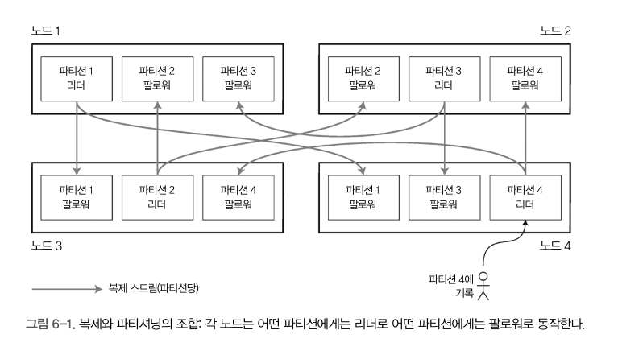

# 6장

## 파티셔닝과 복제

- 복제와 파티셔닝을 함께 적용해 각 파티션의 복사본을 여러 노드에 저장
    - 각 레코드는 정확히 한 파티션에 속하더라도, 여러 다른 노드에 저장해서 `내결함성`을 보장할 수 있다.
- 한 노드에 여러 파티션을 저장할 수도 있다. `리더 팔로워` 복제 모델을 사용하면 파티셔닝과 복제의 조합은 아래 이미지 같은 형태가 된다.
    - 각 파티션의 리더는 하나의 노드에 할당되고 팔로워는 다른 노드에 할당된다.
    - 각 노드는 어떤 파티션에게는 리더이면서 다른 파티션에게는 팔로워가 된다.

## 키-값 데이터 파티셔닝

`skewed (쏠렸다)` : Partitioning 이 고르게 이뤄지지 않아 다른 파티션보다 데이터가 많거나 질의를 많이 받는 파티션이 있는 경우 → 쏠림이 있으면 파티셔닝의 효과가 매우 떨어짐

- 극단적 경우 모든 부하가 한 파티션에 몰려 10개 중 9개 노드는 유휴 상태에 있고 요청을 받는 노드 하나가 병목이 될 수 있다.
- `핫스팟` : 불균형하게 부하가 높은 파티션을 지칭하는 용어
- 핫스팟 회피 방법 → 레코드를 할당할 노드를 무작위로 선정 → 레코드는 균등하게 분산되지만, 질의를 할 때 어느 노드에 데이터가 있는지 모르기 때문에 모든 노드에 병렬로 질의를 날려야 한다.

### 키 범위 기준 파티셔닝

- 각 파티션에 연속된 범위의 키를 할당하는 것
    - 어떤 파티션이 어느 노드에 할당됐는지 알면 적절한 노드로 요청을 직접 보낼 수 있다.
    - ex) 어떤 최솟값에서 최대값까지
- 키 범위 크기가 반드시 동일할 필요는 없다.

**장점**

- 각 파티션 내에서는 키를 **정렬된** 순서로 저장 가능(SS Table, LSM Tree)
    - 범위 스캔이 쉬워진다.

**단점**

- 특정한 접근 패턴이 `핫스팟`을 유발하는 단점 존재한다.
    - 예시 이해가 안되네 (203pg 두번째 문단)
    - 쓰기 연산이 모두 특정한 파티션으로 전달되어 해당 파티션만 과부하 걸리고 다른 파티션은 유휴 상태로 남을 수 있다.
- 데이터를 고르게 분산시키려면 파티션 경계를 데이터에 맞춰 조정해야 한다.

### 키의 해시값 기준 파티셔닝

- 키의 파티션을 정하는데 해시 함수를 사용
    - 쏠림과 핫스팟의 위험 피하기 위해
- 좋은 해시함수는 쏠린 데이터를 입력으로 받아(?) 균일하게 분산되게 함
- 해시함수를 정할 땐, 동일한 키에 대해선 동일한 해시값을 반환해야 한다 (203pg 마지막에서 두번째 문단 참조)

- 키를 파티션 사이에 균일하게 분산시키는게 좋다.
- 파티션 경계는 크기가 동일하도록 나눌 수도 있고 무작위에 가깝게 선택할 수도 있다 (일관성 해싱)

**단점**

- 문제는 키의 해시값을 사용해서 파티셔닝하면 키 범위 파티셔닝의 좋은 속성을 잃어버린다 (range 탐색 불가)
- 이전에는 인접했던 키들이 모든 파티션에 흩어져 정렬 순서가 유지되지 않음.
    - MongoDB 에서는 해시 기반 샤딩 모드를 활성화하면 범위 질의가 모든 파티션에 전송돼야 한다.

### 쏠림 작업 부하와 핫스팟 완화

- 키를 해싱하여 파티션을 정하면 핫스팟을 줄이는데 도움이 되지만 완벽히 제거할 순 없다.
- 항상 동일한 키를 읽고 쓰는 극단적인 상황에서는 모든 요청이 동일한 파티션으로 쏠리게 된다.
    - ex) 수백만명의 팔로워를 지닌 인플루언서의 새로운 게시글에 댓글이 증폭할 때
    - 이 경우 동일한 키(하나의 파티션이 감당하는)에 막대한 양의 데이터를 기록해야 할 수 있다.
- 요청이 매우 쏠리는 키를 발견했을 때 간단한 해결책은 각 키의 시작이나 끝에 임의의 숫자를 붙이는 것
    - (이해 안됨 205pg 밑에서 세번째 문단)
- 임의의 10진수 두 개만 붙이더라도 한 키에 대한 쓰기 작업이 100개(왜 100개?)의 다른 키로 균등하게 분산 → 그 키들은 다른 파티션으로 분산될 수 있다.

## 파티셔닝과 보조 색인

### 문서 기준 보조 색인 파티셔닝

- 예를 들어 중고차 판매 데이터베이스 가정
- 각 항목에는 문서 ID 가 있고 DB를 문서 ID 기준으로 파티셔닝

- 차를 검색할 때 색상과 제조사로 필터링할 수 있게 하려면 `color` 와 `make` 에 보조색인을 만들어야 한다.
- 색인을 선언하면 DB 가 자동으로 색인 생성을 할 수 있다.
    - 빨간색 자동차가 데이터베이스에 추가되면 데이터베이스 파티션은 자동으로 그것을 color: red 색인 항목에 해당하는 문서 ID 목록에 추가
- 이런 색인 방법의 장점 : 각 파티션이 완전히 독립적으로 동작함
    - 각 파티션은 자신의 보조 색인을 유지하며 그 파티션에 속하는 문서만 담당
    - 다른 파티션에 어떤 데이터가 저장되는지 신경쓰지 않아도 된다.
    - DB 에 문서 추가, 삭제 , 갱신 등 쓰기 작업을 실행할 때는 쓰려고 하는 문서 ID 를 포함하는 파티션만 다루면 된다.
    - 이를 `지역 색인(local index)` 라 부른다.
- **Scatter/Gather**
    - 파티셔닝된 데이터베이스에서 모든 파티션으로 질의를 보내 결과를 합산하는 것
    - 여러 파티션에서 질의를 병렬 실행하더라도 스캐터/개더는 꼬리 지연시간 증폭이 발생하기 쉽다.
    - 그럼에도 보조 색인을 문서 기준으로 파티셔닝 하는 경우가 많다.

### 용어(전역) 기준 보조 색인 파티셔닝

- 모든 파티션에 존재하는 빨간색 자동차 정보는 보조 색인에서 color:red 항목에 저장됨
    - `color:red` 를 비롯한 색깔 색인 자체는 `a`부터 `r`까지는 파티션 0에, `s`부터 `z`까지의 글자로 시작하는 색깔은 파티션 1에 저장되도록 파티셔닝.
- term-partitioned : 찾고자 하는 용어에 따라 색인의 파티션이 결정된다.
    - 용어 자체로 파티셔닝하면 범위 스캔에 유용한 반면,
    - 용어의 해시값을 사용해 파티셔닝하면 부하가 좀 더 고르게 분산된다.
- 문서 파티셔닝 색인에 비해 전역(용어) 색인이 갖는 이점 : 읽기 효율성 UP
    - client 는 모든 파티션에 스케터/개더 실행할 필요 없이 원하는 용어를 포함하는 파티션으로만 읽기 요청 보내면 된다.
- 대신 전역 색인은 쓰기가 느리고 복잡하다는 단점 존재
    - 전역 보조 색인은 대게 비동기로 갱신됨
        - AWS DynamoDB 는 정상적인 상황에서 전역 보조 색인 갱신에 1초도 안걸리지만, 인프라 결함 생기면 반영 지연 시간이 길어질 수 있다.

## **파티션 재균형화**

`재균형화` : 클러스터에서 한 노드가 담당하던 부하를 다른 노드로 옮기는 과정을 재균형화(rebalancing) 이라고 한다.

- 재균형화 후 부하가 클러스터에 있는 노드들 사이에 균등하게 분배돼야 함
- 재균형화 도중 데이터베이스는 읽기 쓰기 요청을 받아들여야 한다.

### Mod N 방법

- hash(key) mod 10(N) -> 0 ~ 9 (output)
- 전체 노드 수(N)가 바뀔때 output 결과도 변경되기 때문에 엄청난 데이터 이동이 발생한다.
    - ex) **`(123456 mod 10 = 6)`**, **`(123456 mod 11 = 3)`**, **`(123456 mod 12 = 0)`**

### 정적 파티셔닝 (파티션 개수 고정)

파티션 개수가 고정되어 데이터 크기에 따라 `노드 x 노드당 파티션 개수 = 전체 파티션 개수`가 된다.

- ex) 노드(4) x 파티션(5) = 20 → 노드(5) x 파티션(4) = 20
- 전체 데이터셋의 크기 변동이 심하면 적절한 파티션 개수를 정하기 어려움
- 파티션이 너무 커지면 재균형화 및 장애 복구 비용이 큼
- 적절한 크기를 정하는 것이 제일 Best, 하지만 어려움
- 리악, 엘라스틱서치, 카우치베이스, 볼드모트 에서 사용

### 동적 파티셔닝

- 파티션 개수가 전체 데이터 용량에 맞춰 조정됨 (크기를 제한하고 개수를 늘림)
- 빈 데이터베이스의 경우 파티션 경계 설정 값에 도달하기 전에는 파티션이 1개임
    - HBase 와 MongoDB 는 빈 데이터베이스에 초기 파티션 집합을 설정할 수 있음 → 사전 분할 (pre-splitting)

**정적 파티셔닝 & 동적 파티셔닝 특징 정리**

- 정적 파티셔닝 : 파티션 `크기`가 데이터 크기에 비례
- 동적 파티셔닝 : 파티션 `개수`가 데이터 크기에 비례

### 노드 비례 파티셔닝

- 파티션 개수가 노드 대수에 비례하게 유지하는 것 → 노드 당 파티션 개수를 고정한다.
- 노드 대수에 변동이 없는 동안은 개별 파티션 크기가 데이터셋 크기에 비례해 증가하지만, 노드 대수를 늘리면 파티션 크기가 다시 작아진다.
- 새 노드가 클러스터에 추가되면 고정된 개수의 파티션을 무작위로 선택해 분할 → 각 분할된 파티션의 절반은 그대로 유지하고 다른 절반은 새 노드에 할당
- 파티션 경계를 무작위로 선택하려면 `해시 기반 파티셔닝` 방법 사용
    - 해시 함수를 통해 생성된 숫자 범위로부터 파티션 경계 선택

### 운영 : 자동 재균형화와 수동 재균형화

완전 자동 재균형화와 완전 수동 재균형화 사이에는 중간 지점이 있다. 

- `Couchbase` 는 자동으로 파티션 할당을 제안하지만 반영 되려면 관리자가 확정해야 한다.

`Rebalancing`은 `요청 경로를 재설정`해야 하고 `대량의 데이터를 노드 사이에 이동`해야 하므로 비용이 큰 연산이다.

때문에 자동화는 자동 장애 감지와 조합되면 위험해질 수 있다. 

- 예를 들어 노드 한 대에 과부하가 걸려 일시적으로 요청 응답이 느려지면, 다른 노드들은 과부하 걸린 노드가 죽었다고 간주 → 해당 노드로부터 부하를 다른 곳으로 옮기기 위해 자동으로 클러스터를 재균형화 하려고한다.
- 그러면 과부하 걸린 노드와 다른 노드, 그리고 네트워크에 부하를 더해서 상황이 더 악화될 수 있다.

**Q. 리밸런싱 발생할 때 파티셔닝은 새로운 노드에 파티션을 할당하는 것 처럼 보인다 → 이는 샤딩 아닌가?**

## **요청 라우팅**

- 파티션이 재균형화되면서 노드에 할당되는 파티션이 바뀐다.
- 이는 DB vendor 에 국한되지 않는 더욱 일반적인 문제인 `서비스 찾기`의 일종
- 분산 데이터 시스템은 클러스터 메타데이터를 추적하기 위해 `주키퍼(Zookeeper)` 같은 코디네이션 서비스를 사용.
    - 각 노드는 주키퍼에 자신을 등록하고 주키퍼는 파티션과 노드 사이의 신뢰성 있는 할당 정보를 관리

1. 클라이언트가 아무 노드에나 접속 → 해당 노드에 마침 요청을 적용할 파티션이 있다면 거기서 요청을 직접 처리 → 그렇지 않으면 올바른 노드로 전달해서 응답 받고 클라이언트에게 응답 전달
2. 클라이언트의 모든 요청을 라우팅 계층으로 보낸다. 각 요청을 처리할 노드를 알아내고 해당 노드로 요청을 보낸다. 파티션 인지 로드밸런서로 동작한다.
3. 클라이언트가 파티셔닝 방법과 파티션이 어떤 노드에 할당됐는지를 알고 있게 한다. 클라이언트는 중재자 없이 올바른 노드로 직접 접속할 수 있다.

## **병렬 질의 실행**

- 대규모 병렬 처리 관계형 DB 제품은 훨씬 복잡한 종류의 질의를 제공함
- 전형적인 DW 질의는 Join, Filtering, Grouping, Aggregation 연산을 몇개 포함한다.
- MPP 질의 최적화기는 복잡한 질의를 여러 실행 단계와 파티션으로 분해하며 이들 중 다수는 데이터베이스 클러스터 내의 서로 다른 노드에서 병렬적으로 실행될 수 있다.

## 파티셔닝

데이터 셋이 매우 크거나 질의 처리량이 높다면 복제만으론 부족하고 데이터를 파티션으로 쪼갤 필요가 있다.

- `목적` : 데이터와 질의 부하를 노드 사이에 고르게 분산 시키는 것
- 각 노드에서 자신의 파티션에 해당하는 질의를 독립적으로 실행 가능 → 노드를 추가하여 질의 처리량을 늘릴 수 있다.

### 파티셔닝의 주된 목적

1. `확장성`
    1. 비공유 클러스터에서 파티션은 서로 다른 노드에 저장될 수 있다. 즉 대용량 데이터셋이 여러 디스크에 분산될 수 있어 질의 부하도 여러 프로세스에 분산된다.
2. 로그 데이터의 효율적인 관리
    1. 불필요한 데이터 삭제 작업은 단순히 파티션을 추가하거나 삭제하는 식으로 간단히 해결할 수 있다.