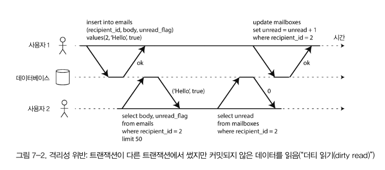

# 7장

## 애매모호한 트랜잭션의 개념

### ACID 의미

- Atomicity 원자성
- Consistency 일관성
- Isolation 격리성
- Durability 지속성

DB에서 내결함성 메커니즘을 나타내는 정확한 용어를 확립하기 위해 ACID 를 만들었다.

### 원자성

`원자성`이란 더 작은 부분으로 쪼갤 수 없는 무언가를 의미한다. 컴퓨터 공학적으로 말하면 시스템은 연산을 실행하기 전이나 실행한 후의 상태에만 있을 수 있으며 그 중간상태에는 머물 수 없다.

원자성은 `동시성`과 관련이 없음을 인지해야한다. 여러 프로세스가 동시에 같은 데이터에 접근할 때 발생하는 문제는 I (격리성)와 관련있지 원자성은 이에 대해 설명하지 않는다.

대신 원자성은 클라이언트가 쓰기 작업 여러개를 실행하는데 그중 일부만 처리된 후 결함이 생기면 무슨 일이 생기는지 설명할 수 있다. 여러 쓰기 작업이 하나의 원자적인 트랜잭션으로 묶여 있는데 결함때문에 완료(commit)될 수 없다면 Abort (취소) 되고 DB 는 이 트랜잭션에서 지금까지 실행한 쓰기를 모두 취소해야한다.

오류가 생겼을 때 트랜잭션을 abort 하고 해당 트랜잭션에서 기록한 모든 내용을 취소하는 능력은 ACID 원자성의 특징이다. **`Abortability (어보트 능력)`이 원자성 보다 나은 설명일 수도 있다.**

### 일관성

ACID 일관성의 아이디어는 항상 진실인, 데이터에 관한 어떤 선언(불변식)에 있다. 일관성을 유지하도록 트랜잭션을 올바르게 정의하는 것은 애플리케이션의 책임이다.

### 격리성

동시에 실행되는 트랜잭션은 서로 격리되어 서로 방해할 수 없다.

### 지속성

DB 시스템의 목적은 데이터 **유실** **염려가 없는 안전한 저장소를 제공**하는 것이다. (물론 모든 하드디스크와 백업이 동시에 파괴되면 당연히 DB가 해줄 수 있는 것은 아무것도 없기 때문에 완벽한 지속성은 존재하지 않는다)

복제기능이 있는 DB에서 지속성은 데이터가 성공적으로 다른 노드 몇 개에 복사 됐다는 것을 의미할 수 있다. 지속성을 보장하려면 DB 는 트랜잭션이 성공적으로 커밋됐다고 보고하기 전에 쓰기나 복제가 완료될 때 까지 기다려야 한다.

## 단일 객체 연산과 다중 객체 연산

### 격리성

**동시에 실행되는 트랜잭션은 서로 방해하지 말아야 한다**. 예를 들어 한 트랜잭션이 여러 번 쓴다면 다른 트랜잭션은 그 내용을 전부 볼 수 있든지 아무것도 볼 수 없든지 둘 중 하나여야 하고 일부분만 볼 수 있어서는 안된다.



### 원자성

그림 7-3 에서 원자성의 필요성이 설명돼 있다.

트랜잭션 실행 도중에 오류가 발생하면 우편함의 내용과 읽지 않는 메시지 개수가 동기화 되지 않을 수 있다. 원자적 트랜잭션에서는 개수 갱신을 실패하면 트랜잭션이 abort 되고 삽입된 이메일은 롤백된다. **즉 트랜잭션이 실행되기 직전의 마지막 커밋 상태로 돌아간다.**


### 단일 객체 쓰기

단일 객체 연산은 여러 클라이언트에서 동시에 같은 객체에 쓰려고 할 때 갱신 손실(lost update)을 방지하므로 유용하다. 그러나 일반적으로 쓰이는 의미의 트랜잭션이 아니다. `트랜잭션`은 보통 다중 객체에 대한 다중 연산을 하나의 실행 단위로 묶는 메커니즘으로 이해된다.

### 완화된 격리 수준

- 동시성 문제는 트랜잭션이 다른 트랜잭션에서 동시에 변경한 데이터를 읽거나 두 트랜잭션이 동시에 같은 데이터를 변경하려 할 때만 나타난다.
- 직렬성 격리 : DB 가 여러 트랜잭션들이 직렬적으로 실행되는 것(즉 동시성 없이 한번에 트랜잭션 하나만 실행)과 동일한 결과가 나오도록 보장한다는 것을 의미
- 인기있는 관계형 DB 시스템 조차 완화된 격리성을 사용하는 경우가 많아서 동시성 버그를 반드시 막아주지는 못한다. → 완전한 격리성을 달성하면 비용과 성능 측면에서 부담되기 때문이 아닐까 유추

## 커밋 후 읽기

- 가장 기본적인 수준의 트랜잭션 격리로 2가지를 보장한다.
    - DB 에서 읽을 때 커밋된 데이터만 보게 된다 (no dirty read)
    - DB 에서 쓸 때 커밋된 데이터만 덮어쓰게 된다. (no dirty write)

### 더티 읽기

- `더티 읽기` : 트랜잭션이 데이터베이스에 데이터를 썼지만 아직 커밋되거나 어보트되지 않았을 때, 다른 트랜잭션에서 커밋되지 않은 데이터를 볼 수 있는 경우


### 더티 쓰기

- `더티 쓰기` : 먼저 쓴 내용이 아직 커밋되지 않은 상태에서 나중에 실행된 쓰기 작업이 커밋되지 않은 값을 덮어버리는 경우 ***(쉽게 말해 아직 커밋되지 않은 데이터를 다른 트랜잭션이 덮어쓰는 것)***
- 보통 먼저 쓴 트랜잭션이 커밋되거나 어보트 될 때 까지 두번째 쓰기를 지연시키는 방법을 사용한다.
- 하지만 커밋 후 읽기는 아래 경우의 경쟁상태는 막지 못한다.
    - 사용자 1이 카운터를 43으로 저장한 첫번째 커밋 후에 두번째 쓰기(사용자2)가 일어났으므로 더티 쓰기가 아니다.


### 커밋 후 읽기 구현

- `PostgreSql`, `SQL server`, `Oracle 11g` 등에서 기본 설정으로 사용되는 격리 수준
- 트랜잭션에서 특정 객체를 변경하고 싶다면 먼저 해당 객체에 대한 잠금을 획득해야 한다.
- 더티 읽기를 막기 위한 한가지 선택으론
    - 동일한 잠금을 사용하여 객체를 읽기 원하는 트랜잭션이 잠금을 획득한 후 읽기가 끝난 후 바로 해제하는 것
    - 객체가 변경됐으나 아직 커밋되지 않은 값을 갖고 있을 때 읽기가 실행되지 않도록 보장 → 더티 읽기 방지
    - 그러나 위 방법은 `**블락킹 이슈**` 때문에 현실에선 잘 사용되지 않는다 → 성능과 트레이드 오프
    - 대부분의 데이터베이스는 아래 그림같은 방법으로 더티 읽기를 방지한다.
    - 즉 해당 트랜잭션이 실행중인 동안 그 객체를 읽는 다른 트랜잭션들은 과거의 값을 읽게 된다. 새 값이 커밋돼야만 다른 트랜잭션들이 새 값을 읽을 수 있게 된다.
    
    
    

**발생할 수 있는 이슈**

- Dirty Read 는 발생하지 않지만 `Non-Repeatable Read` **와 `Phantom Read` 발생 가능성 존재
    - `Commit` 된 데이터를 읽는 순간, 그 이후에 발생한 다른 트랜잭션에 의해 값이 변경될 수 있기 때문
    

## 스냅숏 격리와 반복 읽기


- 앨리스는 영문도 모른채 두 계좌의 합이 900 달러인 결과를 보게 된다. (원래 1000$ 인데)
- 이런 이상 현상을 `비반복 읽기(non-repeatable read)`나 `읽기 스큐` 라 부른다.
    - 읽기 스큐는 커밋 후 읽기 격리에서는 받아들일 수 있는 것으로 여겨진다.
- `**스냅숏 격리**`는 이런 문제의 가장 흔한 해결책
    - `Postgresql`, `Mysql` 등에서 지원
    - 트랜잭션이 특정 시점에 고정된 DB의 일관된 스냅숏만 볼 수 있다
    - 즉 트랜잭션 시작시 DB 에 커밋된 상태였던 모든 데이터를 본다.
- 앨리스는 자신의 트랜잭션이 시작할 때의 전체 DB Snapshot 을 읽기 때문에 중간에 계좌 2의 값이 변경되더라도 해당 데이터는 읽지 않는다. 어떻게 보면 최신의 데이터는 읽지 않는 것.
- 근데 만약 쓰기 상황이라면 어떻게됨..? 바로 밑에 나옴

### 스냅숏 격리 구현

- 쓰기를 실행할 때는 더티 쓰기를 방지하기 위해 잠금을 사용하지만, 읽을 때는 아무 잠금이 필요하지 않다.
- ⭐️⭐️⭐️ 핵심은 **읽는 쪽에서 쓰는 쪽을 결코 차단하지 않고, 쓰는 쪽에서 읽는 쪽을 결코 차단하지 않는다.**


- 쓰는 동안 락을 사용하지만 그게 다른 읽기 트랜잭션을 막지 않는다.
- **커밋 후 읽기와 다른 점** : 다른 트랜잭션의 커밋 유무와 상관없이 자기가 찍은 스냅샷의 상태만 읽는다.
    - 위 (커밋 후 읽기) 예시에서 앨리스는 두가지 스냅샷을 본 것으로 간주된다.(송금 트랜잭션의 시작전과 커밋 후)
- DB 가 객체의 여러 버전을 함께 유지하므로 이 기법은 `**다중 버전 동시성 제어**` 라고 한다.
    - 239pg 두번째 문단 마지막 줄 무슨의미..?

### 일관된 스냅숏을 보는 가시성 규칙

1. DB 는 각 트랜잭션을 시작할 때 그 시점에 진행 중인 모든 트랜잭션의 목록을 만든다. 이 트랜잭션들이 쓴 데이터는 모두 무시된다.
2. 어보트된 트랜잭션이 쓴 데이터는 모두 무시된다.
3. 트랜잭션 ID 가 더 큰(즉 현재 트랜잭션이 시작한 후 실행된) 트랜잭션이 쓴 데이터는 그 트랜잭션의 커밋 여부에 상관없이 모두 무시된다. → 지 스냅샷만 보겠다는 의미
4. 그 밖의 모든 데이터는 애플리케이션의 질의로 볼 수 있다. (how?)

### 반복 읽기와 혼란스러운 이름

`스냅숏 격리`는 유용한 격리 수준이며 특히 읽기 전용 트랜잭션에서 유용한다. → Lock 을 걸지 않으니까

흔히 Mysql 에서 `반복 읽기(repeatable read)` 라 부르는 개념이다.

- `반복 읽기(repeatable read)` : 특정 행 조회시 항상 동일한 데이터를 응답하는 것을 보장하는 격리수준

## 갱신손실 방지

- 만약 두 트랜잭션이 작업을 동시에 하면 두번째 쓰기 작업이 첫 번째 변경을 포함하지 않으므로 변경 중 하나는 손실될 수 있음 → 동시성 문제를 말하는 것 같다.

**해결책**

- 원자적 쓰기 연산
- 명시적인 잠금
- 갱신 손실 자동 감지
- Compare-and-set
- 충돌 해소와 복제

### 원자적 쓰기 연산

- 객체를 읽을 때 그 객체에 `독점적인 잠금(Exclusive Lock)`을 획득해서 구현
    - 갱신이 적용될 때 까지 다른 트랜잭션에서 그 객체를 읽지 못하게 한다.
- 또는 모든 원자적 연산을 단일 스레드에서 실행되도록 강제하는 방법
- ORM 을 쓰면 DB가 제공하는 원자적 연산 대신 불안전한 read-modify-write 주기를 실행하는 코드를 작성하기 쉽다. why?

### 명시적인 잠금

- 애플리케이션에서 갱신할 객체를 명시적으로 잠그는 것
- JPA 에서 엔티티를 조회 시 `LockMode` 를 지정하거나 `select for update` 쿼리를 통해 직접 잠금 지정


### Compare and set

- 값을 마지막으로 읽은 후에 변경되지 않았을 때만 갱신을 허용함으로써 갱신 손실을 회피
    - 현재 값이 이전에 읽은 값과 일치하지 않으면 갱신은 반영되지 않고 read-modify-write 주기를 재시도해야 한다.
- Lock 을 사용하지 않기 때문에 높은 성능 유지 가능
- **Java Atomic 클래스에서도 사용하는 알고리즘**
    - 멀티스레드 환경에서 각 CPU(아래 이미지 core 에 해당) 는 메인 메모리의 heap 에서 변수를 참조하는게 아닌, 각 CPU 의 캐시 영역에서 값을 참조한다.
    - 이 때 heap 에 저장된 값과 CPU 캐시에 저장된 값이 다른 경우가 존재 → 가시성 문제
    - 현재 스레드의 저장된 값과 heap 에 저장된 값을 비교하여 일치하는 경우 새로운 값으로 교체하고, 불일치 하면 재시도한다.
        - 참고로 `synchronized` 의 경우 `synchronized` block 진입 전후에 메인 메모리와 CPU 캐시 메모리의 값을 동기화 하기 때문에 문제가 없도록 처리한다.


### 충돌 해소와 복제

- 잠금과 compare and set 연산은 **데이터의 최신 복제본**이 하나만 있다고 가정 → 싱글 노드
- 다중 리더 또는 리더없는 복제를 사용하는 DB 는 여러 쓰기가 동시에 실행되고 비동기식으로 복제되는 것을 허용하기 때문에 최신 복제본이 하나만 있다고 보장할 수 없다.
- 복제가 적용된 DB 에서는 쓰기가 동시에 실행될 때 한 값에 대해 여러개의 충돌된 버전(sibling)을 생성하는 것을 허용하고 **사후에 애플리케이션 코드나 특별한 데이터 구조를 사용해 충돌을 해소**하고 이 버전들을 병합

## 쓰기 스큐와 팬텀


### 쓰기 스큐를 특정 짓기

- 거의 동시에 두 트랜잭션이 시작됐다고 가정
- DB 에서 스냅숏 격리를 사용하므로 두 트랜잭션 모두 2를 반환해서 다음 단계로 진행함
- 두 트랜잭션이 두 개의 다른 객체를 갱신하므로 더티 쓰기도 갱신 손실도 아니다.
- 트랜잭션이 동시에 실행됐기 때문에 이상 동작이 나타날 수 있었다.

### **쓰기 스큐를 유발하는 팬텀**


- 어떤 트랜잭션에서 실행한 쓰기가 다른 트랜잭션의 `검색 질의 결과`를 바꾸는 것을 `팬텀(Phantom)` 이라고 함

### **충돌 구체화**

- 충돌 구체화? → 최초의 select 시 잠글 수 있는 객체가 없음 → 인위적으로 데이터베이스에 잠금 객체를 추가하자


- **대상 row 를 미리 만들고 락을 건다** → 트랜잭션 대상이 되는 특정 범위의 모든 조합에 대해 미리 row 를 만들어 둠 (ex, 회의실 예약의 경우 다음 6개월 동안에 해당되는 양)
- 예약을 하는 트랜잭션은 테이블에서 원하는 대상 row 를 잠글 수 있다 (위에서 미리 생성했기 때문에)
- 여기서 생성된 row 는 단지 동시에 변경되는 것을 막기 위한 **잠금의 모음**일 뿐이다 (실제 사용되는 데이터가 아님)
- 단점? → 동시성 제어 메커니즘이 애플리케이션 데이터모델로 새어 나오는 것은 보기 좋지 않음, 다른 대안이 불가능할 때 최후의 수단으로 고려

## 직렬성

DB의 동시성을 관리하는 방식의 문제점

- 격리 수준은 이해하기 어렵고 데이터베이스마다 그 구현에 일관성이 없음
- 애플리케이션 코드를 보고 특정한 격리 수준에서 해당 코드를 실행하는게 안전한지 알기 어려움, 특히 동시에 일어나는 모든 일을 알지 못할 수도 있는 거대한 애플리케이션이라면 더욱.
- 동시성 문제는 보통 비결정적(간헐적) 이라서 테스트하기 어려움. 운이 나쁠 때만 문제가 발생하게 됨
- 대안은 직렬성 격리 사용
- 직렬성 격리는 보통 가장 강력한 경리 수준이라고 여겨짐
- **여러 트랜잭션이 병렬로 실행되더라도, 최종 결과는 동시성 없이 한 번에 하나씩 직렬로 실행될 때와 같도록 보장**

### **직렬성을 제공하는 3가지 기법**

- 말 그대로 트랜잭션을 순차적으로 실행하기
- 2단계 잠금
- 직렬성 스냅숏 격리 같은 낙관적 동시성 제어 기법

### **실제적인 직렬 실행**

- 동시성 문제를 피하는 가장 간단한 방법은 동시성을 완전히 제거하는 것
- 한 번에 트랜잭션 하나씩만 직렬로 단일 스레드에서 실행하면 됨
- 단점? → 성능 (단일 스레드 보단 멀티 스레드가 성능이 좋으니)
- 대표적인 예시 Redis
    - **redis는 단일 스레드인데 동시성 왜 발생하지**

### **트랜잭션을 스토어드 프로시저 안에 캡슐화 하기**

- 데이터베이스 초창기에는 트랜잭션이 사용자의 활동 전체 흐름을 포함할 수 있게 하려는 의도가 있었음
- 항공권 예약의 여러 과정 (경로 선택, 요금, 가용 좌석 탐색, 여행 일정표 정하기, …) 을 하나의 트랜잭션으로 표현하고 원자적으로 커밋하는 것임
- 이 방법을 구현하기 위해 데이터베이스 트랜잭션이 사용자의 입력을 기다려야 한다면, 매우 느릴 것으로 예상됨
- 대신에 트랜잭션 코드 전체를 스토어드 프로시저 형태로 데이터베이스에 미리 제출함
- 트랜잭션에 필요한 데이터는 모두 메모리에 있고, 스토어드 프로시저는 네트워크나 디스크 I/O 없이 매우 빨리 실행된다고 가정함

**장단점**

- DB 마다 제각각 프로시저 언어가 존재 → 범용 프로그래밍 언어의 발전을 따라 잡지 못함
- DB 에서 실행되는 코드는 관리하기 어렵다.
- 성능 이슈

**직렬 실행 요약**

트랜잭션 직렬 실행은 몇 가지 제약 사항 안에서 직렬성 격리를 획득하는 실용적인 방법이 됐음

- 모든 트랜잭션은 작고 빨라야 한다. 느린 트랜잭션 하나가 전체 처리를 지연시킬 수 있기 때문.
- 활성화된 데이터셋이 메모리에 적재될 수 있는 경우로 사용이 제한됨, 단일 스레드 트랜잭션에서 디스크에 접근한다면 시스템이 매우 느려짐 (?)
- 쓰기 처리량이 단일 CPU 코어에서 처리할 수 있을 정도로 충분히 낮아야 함
- 여러 파티션에 걸친 트랜잭션도 쓸 수 있지만, 이것을 사용할 수 있는 정도에는 엄격한 제한이 있음

## **2단계 잠금(2PL)**

- 트랜잭션이 잠금을 획득한 후에는 트랜잭션이 종료될 때 까지 잠금을 갖고 있어야 한다. (그래서 2단계라 불림)
- 트랜잭션 A가 객체 하나를 읽고 트랜잭션 B가 그 객체에 쓰기를 원한다면 B는 진행하기 전에 A가 커밋되거나 어보트될 때까지 기다려야 한다(이렇게 하면 B가 A 몰래 갑자기 객체를 변경하지 못하도록 보장된다).
- 트랜잭션 A가 객체에 썼고 트랜잭션 B가 그 객체를 읽기 원한다면 B는 진행하기 전에 A가 커밋되거나 어보트될 때까지 기다려야 한다(그림 7-4에 나왔듯이 2PL을 쓸 때는 객체의 과거 버전을 읽는 게 허용되지 않는다).

### snapshot 격리와 비교

- snapshot : 읽는 쪽은 결코 쓰는 쪽을 막지 않으며, 쓰는 쪽도 결코 읽는 쪽을 막지 않음
- 2PL : 쓰기는 다른 쓰기 뿐 아니라 읽기도 막아벌임

### **2단계 잠금 구현**

- MySQL, SQL Server 에서 직렬성 격리 수준을 구현하는데 사용됨
- 잠금은 공유 모드 (shared mode) 나 독점 모드 (exclusive mode) 로 사용될 수 있음
    - `공유 잠금` : 다른 트랜잭션에서 읽기를 원할 때 → 동시에 다른 트랜잭션이 읽기를 원할 때 공유 모드로 잠금을 획득하는 것은 허용.
        - 하지만 독점 모드로 잠금을 획득한 트랜잭션은 끝날 때 까지 기다려야 한다.
- 잠금이 아주 많이 사용되므로 교착 상태(두 개의 트랜잭션이 서로 기다리는 것)가 매우 쉽게 발생할 수 있음

### **2단계 잠금의 성능**

- 가장 큰 약점이 성능
- 잠금을 획득하고 해제하는 오버헤드 때문에 느린 것

### **서술 잠금**

조건에 부합하는 모든 객체에 잠금을 획득하는 것

```sql
**SELECT** ***** **FROM** bookings **WHERE** room_id **=** **123
AND** end_time **>** '2018-01-01 12:00'
**AND** start_time **<** '2018-01-01 13:00';
```

- 서술 잠금은 오래 걸림 (조건에 부합하는 잠금을 확인하는 데 시간이 오래 걸림)
- 이 때문에 2PL 을 지원하는 대부분의 데이터베이스는 실제로는 `색인 범위 잠금`, `다음 키 잠금`을 구현하여 사용함

### **색인 범위 잠금**

- 예를 들어, 정오와 오후 1시 사이에 123번 방을 예약하는 것에 대한 서술 잠금을 → 모든 시간 범위에 123번 방을 예약하는 것으로 근사시켜 잠금 실행
- 위의 그림 예시에서 room_id 또는 시간 값에 색인이 걸려있을 것이기에 해당 색인 범위에 lock 을 거는 것임
- 색인 범위 잠금은 서술 잠금 보다 정밀하지 않지만(직렬성을 유지하기 위해 반드시 필요한 것보다 더 큰 범위를 잠글 수도 있음) 오버헤드가 낮기 때문에 좋은 타협안이 됨
- 범위 잠금을 잡을 수 있는 적합한 색인이 없다면 테이블 전체에 공유 잠금을 잡는 것으로 대체하기도 함

## **직렬성 스냅숏 격리 (Serializable Snapshot Isolation, SSI)**

- **낙관적 동시성 제어**
- 직렬성 격리와 좋은 성능은 공존할 수 있을까?
- 현재 최고로 유망한 것이 직렬성 스냅숏 격리임
- 스냅숏 격리에 비해 약간의 성능 손해만 있을 뿐임

### **비관적 동시성 제어 vs 낙관적 동시성 제어**

- 2단계 잠금은 비관적 동시성 제어 메커니즘임
    - 뭔가 잘못될 가능성이 있으면 뭔가를 하기 전에 상황이 다시 안전해질 때 까지 기다리는게 낫다는 원칙
- 직렬성 스냅숏 격리는 낙관적 동시성 제어 메커니즘임
    - 뭔가 위험한 상황이 발생할 가능성이 있을 때 트랜잭션을 막는 대신 모든 것이 괜찮아질 거라는 희망을 갖고 계속 진행한다는 뜻
    - 트랜잭션이 커밋되기를 원할 때 데이터베이스는 나쁜 상황이 발생했는지 확인함
    - 발생했다면 abort 되고 재시도함
    - 경쟁이 심하면 abort 비율이 높아지므로 성능 떨어짐
    - 예비 용량이 충분하고 트랜잭션 사이의 경쟁이 너무 심하지 않으면, 낙관적 동시성 제어 기법이 성능이 좋은 경향이 있음
    - SSI = 스냅숏 격리 + 직렬성 충돌 감지 및 abort 시킬 트랜잭션 결정하는 알고리즘

### **오래된 읽기 감지하기**


### **과거의 읽기에 영향을 미치는 쓰기 감지하기**

