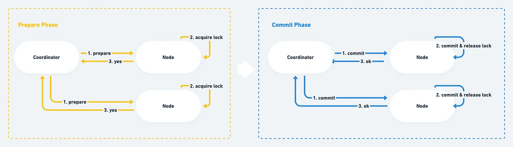

# 9장

# 2PC

`**정의**` : 분산 시스템에서 여러 노드에 걸친 `원자적 트랜잭션`을 달성하여 모든 노드가 커밋/어보트 되도록 보장하는 알고리즘

`**개요**` : 2PC 는 일시적인 시스템 장애가 발생하더라도 원자적 트랜잭션 커밋이라는 목표를 달성하기에 널리 사용된다. 하지만 모든 장애구성에 탄력적(resilient)이진 않으며 결과를 해결하기 위해 수동 개입이 필요한 경우도 드물게 존재한다.

### **2PC 단계**

여러 노드 중 한 노드가 2PC 를 시작하는 코디테이터(=트랜잭션 관리자) 역할을 맡게 된다.

2단계로 이루어져 있다.(당연함)

- 준비 단계(or voting phase) : 다른 노드에게 트랜잭션을 커밋할 수 있는지 여부 요청
- 커밋 단계 : 다른 노드에게 트랜잭션을 커밋하거나 어보트하라고 명령(command)



```kotlin
***준비 단계***
: 1. prepare -> 2. acquire lock -> 3. ack (yes/no)

***커밋 단계***
: 1. commit -> 2. commit & release lock -> 3. ack (ok)
```

### 준비 단계

- 준비 단계에서 노드가 코디네이터에게 `yes` 를 응답하면 해당 노드는 어떠한 장애 시나리오에도 트랜잭션을 커밋해야 한다. 이는 일종의 약속이자 선언이다.
- 이 선언을 지키기 위해 노드는 `yes` 를 보내기 직전에 트랜잭션 데이터를 `**디스크에 기록**`한다. 노드가 다운돼도 장애 회복 후 디스크의 트랜잭션 기록을 보고 복구할 수 있다.
    - 만약 `yes` 를 보낸 후 해당 노드가 다운되면 코디네이터는 커밋이 **완료될 때 까지** 커밋을 재시도한다.

### 커밋 단계

**성공**

1. 코디네이터는 모든 참가자에게 커밋 메시지 전송
2. 각 참가자는 작업을 완료하고 트랜잭션 동안 보유했던 모든 잠금과 리소스를 해제
3. 각 참가자는 코디네이터에게 ok 전송
4. 코디네이터는 모든 확인을 받으면 트랜잭션 커밋

**실패**

1. 준비 단계에서 참가자가 no 에 투표하거나 코디네이터의 **타임아웃이 만료되면** 트랜잭션 실패 
2. 각 참가자는 실행 취소 로그를 사용하여 트랜잭션을 실행 취소하고 트랜잭션 중 보유했던 리소스와 잠금을 해제
3. 각 참가자는 코디네이터에게 ok 전송
4. 코디네이터는 모든 승인이 수시되면 트랜잭션을 어보트

### 코디네이터 장애 시

- 코디네이터는 모든 노드로부터 응답을 받은 후 최종 결정을 보내기 전 디스크에 기록해야 한다.
- 코디네이터가 통신 중 다운 되더라도 복구 후에 로그 기록을 보고 어떻게 행동해야 하는지 알 수 있다.


---

## 2PC 구현

가장 간단한 방법은 주키퍼를 사용하는 것으로 현실에서 직접 2PC 프로토콜을 처음부터 개발할 필요는 없다.

주키퍼 같은 오픈소스를 활용하여 작업하는게 일반적이다.

---

# 선형성

- **정의** : 분산 시스템의 일관성 모델을 설명하는 개념으로, 개별 개체의 `**읽기 및 쓰기**`에 최신성을 보장한다.
- `최신성 보장`과 동일한 맥락의 용어로 일관된 상태를 보장한다.
    - 어떤 클라이언트가 쓰기를 성공적으로 완료하면 데이터베이스를 읽는 모든 클라이언트는 방금 갱신된 값을 볼 수 있어야 한다.
    - **읽힌 값이 뒤쳐진 캐시나 복제본이 아니라는 것을 보장 → `최신성 보장(recency guarantee)`**

### **비선형성으로 알아보는 선형성**


- 선형성이 보장되지 않은 시스템(위 이미지)
    - version2 를 읽은 이후에 version1 을 읽는 경우가 발생
    - 즉 최신이 아닌(= version1) 개체를 읽었기에 비선형적
- 선형성이 보장된 시스템 : 특정 개체의 `version2` 를 읽은 이후의 모든 읽기도 `version2` 를 읽어야 한다 (업데이트가 발생하지 않는다면).

# 선형성을 달성하는 법

## Single Copy

- 선형성은 데이터 복제본이 하나만 있다는 `환상` 을 만들어줌으로 달성할 수 있다.
- 실제로 하나의 데이터 복제본(Single Copy) 만 만들면 손쉽게 선형성을 지킬 수 있지만 시스템의 `내결함성`이 없는 치명적인 문제가 존재한다.

### 단일 리더 복제

- `내결함성`을 지닌 시스템을 만들기 위해선 데이터를 여러 노드에 복제 해야한다.
- 네트워크 지연 등 수많은 장애 시나리오로 인해 선형성을 지키는 것이 쉽지 않지만, 단일 리더 복제 전략이 선형성을 지킬 수 있는 대표적인 방법 중 하나로 알려져 있다.
- 팔로워를 `동기식`으로 복제한다면 선형성을 지킬 수 있지만 `비동기 복제`를 하는 경우 장애 복구 시 쓰기가 손실될 가능성이 있으므로 지속성과 선형성 모두 위반한다.
- 두개의 노드가 리더 역할을 하는 `split brain` 상황도 선형성을 깨트릴 수 있기 때문에 이 역시 방지해야 한다.

### 선형성 장단점

**Advantage**

- 선형성을 보장하는 시스템에선 일관성(consistency) 문제에 대해 전혀 걱정할 필요가 없다.

<aside>
💡 **CAP 정리**

흔히 CAP 정리는 일관성(Consistency), 가용성(Availability), 분단 내성(Partition tolerance) 중 두 개를 고를 수 있다고 표현되지만 이는 오해의 소지가 있다.

- **네트워크 분단은 결함이므로 선택할 수 있는 것이 아니고 반드시 발생하기 때문에 `분단 내성은 반드시 고려`되어야 한다.**
- **즉 CAP 정리는 `네트워크 분단(P)`이 생겼을 때 `일관성(C)`과 `가용성(A)` 중 하나를 선택할 수 있다고 보는게 좋다.**
- 여기서 일관성은 선형성(Strong Consistency)로 보는 것이 옳다.

만약 애플리케이션에서 `**선형성**`이 요구된다면 네트워크 분단 시 **가용성을 보장할 수 없게 된다**.

반대로 애플리케이션에서 선형성을 요구하지 않는다면 네트워크 분단 시 `비선형적`이지만 가용한 상태를 제공할 수 있다.

- **선형성이 필요 없는 애플리케이션은 네트워크 문제에 더 강인하다.(가용성이 좋다)**
</aside>

**Disadvantage**

- 많은 `성능적 비용(cost)`이 수반됨
- 분산 시스템의 아키텍처에 따라 **선형성을 유지하기 위해 peer 간 추가 통신이** 필요할 수도 있고 이로 인해 시스템의 가용성과 성능이 저하될 수 있다.
    - 단일 리더 복제 시스템의 경우 : 단일 리더가 모든 write 를 처리하고 모든 read replicas 는 읽기 요청에 대해 리더의 최신값을 확인하기 때문에 상당한 성능 비용이 발생함.

## 📌 직렬성과의 차이점

`**Serializability**` : 트랜잭션이 병렬로 실행되더라도 최종 결과는 동시성 없이 한 번에 하나씩 순차적으로 실행되는 것을 보장하는 트랜잭션의 격리 특징

- 트랜잭션의 전체 히스토리가 순차적으로 실행되도록 보장하는 전역 속성
- 직렬성이 보장된다고 선형성이 반드시 보장되진 않는다.

`선형화` : 개별 개체의 읽기 및 쓰기에 최신성을 보장하는 지역적 속성 → 여러 개체에 대한 트랜잭션에는 어떤한 보장도 하지 않는다.

- 순서화? 가 지역적인가?

Q. 선형성은 성능 트레이드 오프 때문에 많은 데이터베이스 벤더에서 제공하지 않는 기능이라고 하는데, 단일 리더 복제에서도 사용하지 않는 것인가? 

Q. RedLock Algorithm

ref )

[https://hongilkwon.medium.com/what-is-linearizability-in-distributed-system-db8bca3d432d](https://hongilkwon.medium.com/what-is-linearizability-in-distributed-system-db8bca3d432d)

[https://hongilkwon.medium.com/when-to-use-two-phase-commit-in-distributed-transaction-f1296b8c23fd](https://hongilkwon.medium.com/when-to-use-two-phase-commit-in-distributed-transaction-f1296b8c23fd)

[https://pompitzz.github.io/blog/ComputerScience/DesigningDataIntensiveApplication/ch9.html#선형성의-비용](https://pompitzz.github.io/blog/ComputerScience/DesigningDataIntensiveApplication/ch9.html#%E1%84%89%E1%85%A5%E1%86%AB%E1%84%92%E1%85%A7%E1%86%BC%E1%84%89%E1%85%A5%E1%86%BC%E1%84%8B%E1%85%B4-%E1%84%87%E1%85%B5%E1%84%8B%E1%85%AD%E1%86%BC)