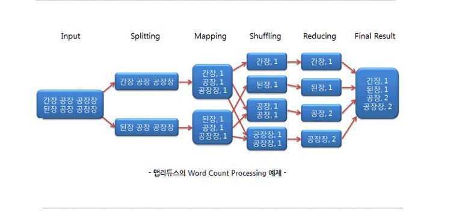
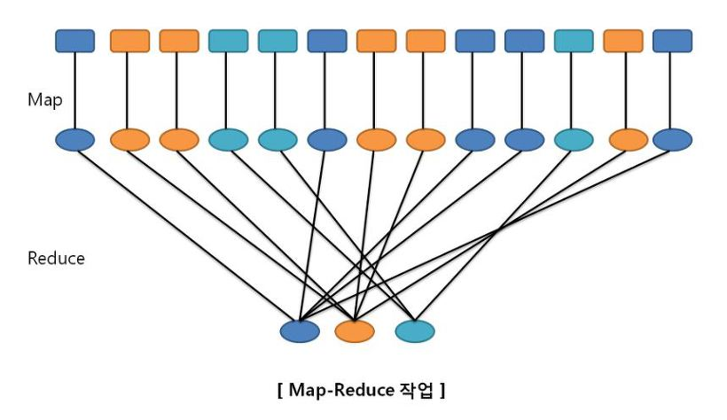
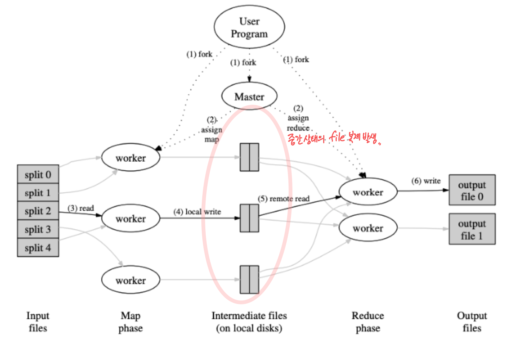

# 맵리듀스
- 대규모 데이터를 처리하기 위한 분산 컴퓨팅 프레임워크로, 대용량 데이터를 여러 대의 컴퓨터에 분산하여 처리하는 방식으로 동작
- Map + Reduce 개념
- 주요한 두 단계로 구성:
  1. 맵(Map) 단계: 입력 데이터를 여러 개의 작은 조각으로 나누고, 각 조각에 대해 특정 함수를 적용하여 중간 결과를 생성
  2. 리듀스(Reduce) 단계: 중간 결과를 모아서 최종 결과를 생성. 이 단계에서는 여러 개의 중간 결과를 하나로 합치는 작업을 수행.
- 대용량 데이터를 효율적으로 처리할 수 있으며, Hadoop 같은 분산 컴퓨팅 시스템에서 주로 사용된다.
- 빅데이터에서 프로세스는 최대한 단순해야 함
  - 프로세스를 단순화 위해서는 기준이 되는 값을 하나로 잡아야 한다.
- Map 에서는 key-value 를 사용하는데, key 값을 이용하면 정렬과 그룹화가 간편해지는 장점 존재
  - 이를 위해 `Map 구조` 사용.

### Job Tracker
- 맵리듀스의 Job 을 제어하는 역할
- 마스터 노드에 존재하며 클러스터의 다른 노드에게 `맵과 리듀스 task` 를 할당한다.

### MapReduce 의 과정
- Input -> Splitting -> Mapping -> Shuffling -> Reducing -> Final Result
- Input : Data 를 입력하는 과정
- Splitting : 데이터를 쪼개어 HDFS 에 저장하는 과정
- Shuffling : 맵 함수의 결과를 취합하기 위해 `리듀스 함수로 데이터를 전달하는 과정`
  - 맵 태스크와 리듀스 태스크의 중간 단계
- Reducing : 모든 값을 합쳐 원하는 값을 추출

### MapReduce 장점
1. 단순하고 사용이 편리(?)
2. 유연성, 특정 DB 모델이나 스키마 정의, query 언어에 의존적이지 않아 데이터 모델을 유연하게 지원 가능
3. 저장 구조가 독립적
4. 확장성 높다

### MapReduce 단점
1. 복잡한 연산 어려움
2. 기존 DBMS 가 제공하는 스키마, 질의 언어, 인덱스 등의 기능 지원 X
3. 상대적 성능이 낮다. 모든 Map 과정이 진행될 때 까지 Reduce 는 시작될 수 없다.

### 맵리듀스 중간 상태 구체화
- 일괄처리 워크플로우에서 각 태스크의 output(중간상태)을 분산 파일 시스템에 파일로 저장(구체화)해두는 방법
  (복잡한 연산을 여러 맵리듀스로 분할하여 처리)

- `분산 파일 시스템`: 태스크의 output을 파일로 저장하는 장치
  - 이 파일은 다른 태스크의 input으로 사용 (주로 태스크 간의 데이터 전달을 위한 용도)
- `중간 상태`: 이러한 파일로 저장되어 있는 상태
  - 복잡한 워크플로우에서는 매우 많은 중간 상태가 존재
- `구체화`: 중간 상태를 파일로 저장하는 과정
  요청이 왔을 때 결과를 생성하는 것이 아니라 미리 특정 연산 결과를 생성해 두는 것
- 
#### (유닉스 파이프 대비) 단점

- 선행 작업이 완료되어야 후행 작업 시작 가능
  - 유닉스 파이프는 동시에 작업이 진행
  - 데이터의 생성과 동시에 소비가 이루어짐
  - 워크플로우의 전체 수행 시간이 느리다.
- 매퍼 중복
  - 매퍼는 리듀서가 생성한 파일을 읽어 파티셔닝과 정렬을 수행
    - 불필요한 IO 발생
    - 리듀서가 매퍼의 기능도 가지게 함으로써 해결 가능
- 분산 파일 시스템의 모든 장비에 중간 상태 파일들의 복제가 발생
  - 중간 상태 파일들은 임시 데이터임에 불구하고, 복제는 분산 파일 시스템을 사용함으로써 발생하는 과도한 비용

 

# 데이터플로우 엔진(Dataflow Engine)
맵리듀스의 문제를 해결하기 위한 분산 일괄 처리 연산을 수행하는 엔진 등장

데이터의 흐름을 명시적으로 모델링 한다.

- 스파크(Spark) : 프레임워크
- 테즈(Tez) : 가벼운 라이브러리
- 플링크(Flink) : 프레임워크
  (프레임워크 : 자체 네트워크 통신 계층, 스케줄러, API 등을 갖춤)

### 특징
- 워크플로우를 독립된 하위 작업으로 나누지 않고 `하나의 작업`으로 다룬다.
- (맵리듀스처럼) 단일 스레드에서 사용자 정의 함수를 호출해 레코드 하나씩 처리
- 입력 데이터를 `파티셔닝`하여 병렬 처리
- 네트워크 복사를 통해 어느 함수의 output이 다른 함수의 input으로 전달된다.

### 연산자
- 데이터 처리에 사용되는 여러 함수

### 맵리듀스 모델 대비 장점

- 정렬 등의 high cost 작업은 필요한 경우에만 수행할 수 있다.
  - 맵리듀스는 기본적으로 map과 reduce 사이에서 정렬이 항상 발생
- 지역성 최적화가 가능하다.
  - 워크플로우가 명시적이므로 어느 데이터가 어느 시점에 필요한지 알 수 있다.
  - 함수간의 데이터 전달을 네트워크 복사가 아닌 메모리 공유로 전달할 수 있다. (네트워크 IO 감소)
- 중간상태는 로컬 디스크에 저장한다. (IO 소비 감소)
  - HDFS(Hadoop Distributed File System)에 저장할 경우 여러 서버에 복제가 필요하다.
- 연산자들은 input이 발생하는 즉시 수행한다.
  - 선행 함수의 전체 종료를 기다리지 않아도 된다.
- 연산자 실행 시 마다 JVM을 띄우지 않아도 된다.
  - 맵리듀스는 각 태스크마다 JVM을 새로 구동한다.

- 데이터플로우 엔진은 맵리듀스의 워크플로우와 동일한 연산을 구현 가능
- 여러 최적화를 통해 일반적으로 수행속도가 훨씬 빠르다.
- 연산자는 맵과 리듀스를 일반화한 것이라 맵리듀스의 워크플로우를 수정없이 간단하게 데이터플로우로 전환할 수 있다.

# 내결함성
- 맵리듀스는 중간 상태를 모두 구체화하기 때문에 내결함성(내구성)을 쉽게 확보할 수 있다.
  - 구체화 : 중간상태를 파일로 저장하는 것
- 데이터플로우 엔진은 HDFS에 중간 상태를 구체화하지 않기 때문에 다른 방법을 사용한다.
  (HDFS를 사용하지 않는 것은 아니다. 원본 데이터는 HDFS에 있다)
  - 로컬에 input 데이터가 남아있으면 다시 연산을 한다. 없으면 HDFS에서 원본 데이터를 가져와서 연산한다.
- 재연산을 하기 위한 연산 추적을 한다.
  - 어느 입력 파티션을 사용했는지 어떤 연산자를 사용했는지 추적해야 한다.
  - 스파크는 RDD(Resilient Distributed Dateset) 추상화를 사용한다.
    - RDD: 데이터의 여러 요소를 모은 immutable 분산형 컬렉션
  - 플링크는 연산자 상태를 체크포인트로 남겨둔다.

재연산 시 멱등성이 보장되어야 한다.
멱등성 보장을 위해 주의해야할 사항
- 데이터의 검색 등을 위해 해시 테이블을 사용하는 경우 → 해시 테이블은 특정 순서를 보장하지 않는다.
- 연산의 로직이 난수에 의존하는 경우 → 난수가 필요할 경우 고정된 시드 사용 등의 방법으로 난수를 제어
- 시스템 시간, 외부 데이터를 사용하는 경우 → 멱등성을 보장하지 못하는 원인은 제거 그러나 만약 중간 데이터의 크기가 작거나 연산이 CPU 리소스를 많이 사용한다면 재연산보다 중간 데이터를 생성하는 것이 효과적일 수 있다.

### ref
- https://medium.com/rate-labs/%EC%8A%A4%ED%8A%B8%EB%A6%BC-%ED%94%84%EB%A1%9C%EC%84%B8%EC%8B%B1%EC%9D%98-%EA%B8%B4-%EC%97%AC%EC%A0%95%EC%9D%84-%EC%9C%84%ED%95%9C-%EC%9D%B4%EC%A0%95%ED%91%9C-with-flink-8e3953f97986
- https://songsunbi.tistory.com/5