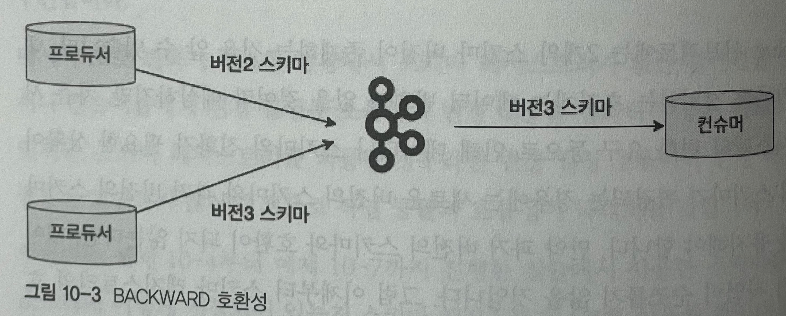

# 10.1 스키마의 개념과 유용성
- 카프카의 데이터 흐름은 대부분 브로드캐스트 방식으로, 카프카는 데이터를 전송하는 프로듀서를 일방적으로 신뢰할 수 밖에 없는 방식.
- 프로듀서 관리자는 토픽의 데이터를 컨슘하는 관리자에게 반드시 데이터 구조를 설명해야 하는데, 컨슈머 관리자가 여러명이라면 데이터 구조를 설명하는 일이 쉽지 않다.
- 데이터를 컨슘하는 여러 관리자에게 해당 데이터를 정확히 설명하는 역할을 하는 것이 `스키마`

# 10.2 카프카와 스키마 레지스트리
- 스키마를 카프카에서 활용할 수 있으면 관리자는 데이터 처리 시 유연성을 확보할 수 있고, 불필요한 커뮤니케이션 비용도 줄일 수 있다.

## 10.2.1 스키마 레지스트리 개요
- 스키마 레지스트리라는 별도의 어플리케이션을 이용해 카프카에서 스키마를 사용할 수 있다.
  - 스키마 레지스트리 : 스키마를 관리하고 등록하는 애플리케이션
  - 아파치 오픈소스 라이브러리가 아닌 컨플루언트 커뮤니티 라이런스
- Avro: 스키마 레지스트리가 지원하는 대표적인 데이터 포맷

## 10.2.2 스키마 레지스트리의 에이브로 지원
- Avro : 데이터 교환을 도와주는 오픈소스 직렬화 시스템
  - 빠른 바이너리 데이터 포맷을 지원하며 JSON 형태의 스키마를 정의할 수 있는 간결한 데이터 포맷
- 그외의 데이터 포맷으로는 JSON, 프로토콜 버퍼가 있지만, 다음과 같은 이유로 Avro 를 가장 권장
  - Json 과 매핑된다.
  - 매우 간결한 데이터 포맷.
  - JSON 은 메시지마다 필드 네임이 포함되어 전송되므로 효율이 떨어진다.
  - 에이브로는 바이너리 형태이므로 매우 빠르다.

- 스키마 레지스트리는 HTTP 기반으로 통신이 이뤄짐

# 10.4 스키마 레지스트리 호환성
- 버전별 스키마 관리를 효율적으로 해주며, 각 스키마에 대해 고유한 ID와 버전 정보를 관리한다.
- 스키마 레지스트리에서는 Backward, Forward, Full 등의 호환성 레벨을 제공한다.

## 10.4.1 Backward 호환성
- 
- 최신 버전의 스키마인 버전3 스키마를 이용해 컨슈머가 데이터를 가져올 때, 컨슈머는 자신과 동일한 버전인 버전3 스키마를 사용하는 프로듀서의 메시지를 처리할 수 있다.
- Backward 호환성의 추가기능으로 한 단계 낮은 버전2를 사용하는 프로듀서가 보낸 메시지도 컨슈머가 처리할 수 있다.
- 

## 10.4.2 Forward 호환성
- Backward 와 대비되는 성질을 지니며, 진화된 스키마가 적용된 프로듀서가 보낸 메시지를 이전 버전의 스키마가 적용된 컨슈머가 읽을 수 있게 하는 호환성을 의미.
- Forward 호환성은 스키마 진화가 일어나는 경우 상위 버전의 스키마를 프로듀서에 먼저 적용한다. (그 다음에 컨슈머에 적용)

- 즉 Forward 든, Backward 든 기준은 상위 버전의 스키마다. 상위 버전의 스키마를 앞단에 위치한 프로듀서에 먼저 적용한다면 Forward, 뒷단에 위치한 컨슈머에 먼저 적용하면 Backward 인 셈이다.
- 그렇다면 Full 호환성은 무엇일까?

## 10.4.3 Full 호환성
- 이는 Forward 와 Backward 를 모두 지원한다.
- 즉 자신과 동일한 버전과 하나 위 버전 또는 하나 아래 버전을 지원할 수 있다.(ex, 버전2로 버전1 또는 버전3 처리 가능)
- 정리하면 가장 최근 2개의 버전 스키마를 지원할 수 있다.(3개 아닌가? `version2` -> version3, version1  -> `version2`)
- 스키마 업데이트 순서는 상관없다.(Forward, Backward 처럼 특정 방향으로 강제하지 않는다.)

## 호환성 가이드를 지키지 않은 경우
- 호환성 레벨의 기본값은 Backward
- Backward 호환성으로 설정할 때, 컨슈머가 아닌 프로듀서에 먼저 진화된 스키마를 가정했다고 가정.
  - 기존에는 name, class 필드만 정의한 스키마 사용 (v1)
  - age 를 추가한 스키마(v2)를 프로듀서에 먼저 적용
  - 호환성 레벨이 Backward 로 돼있기 때문에 컨슈머는 age 필드를 읽지 못하고 무시해버린다. 
